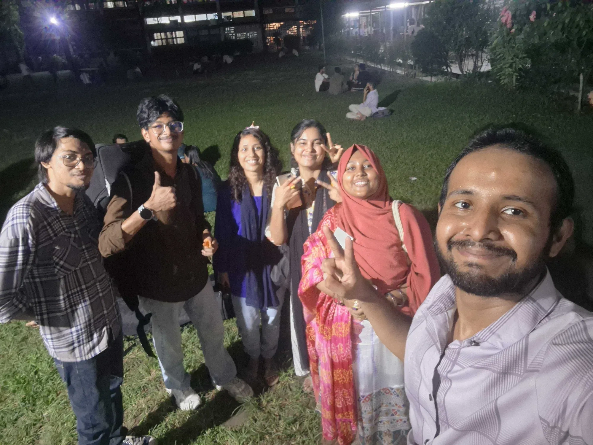
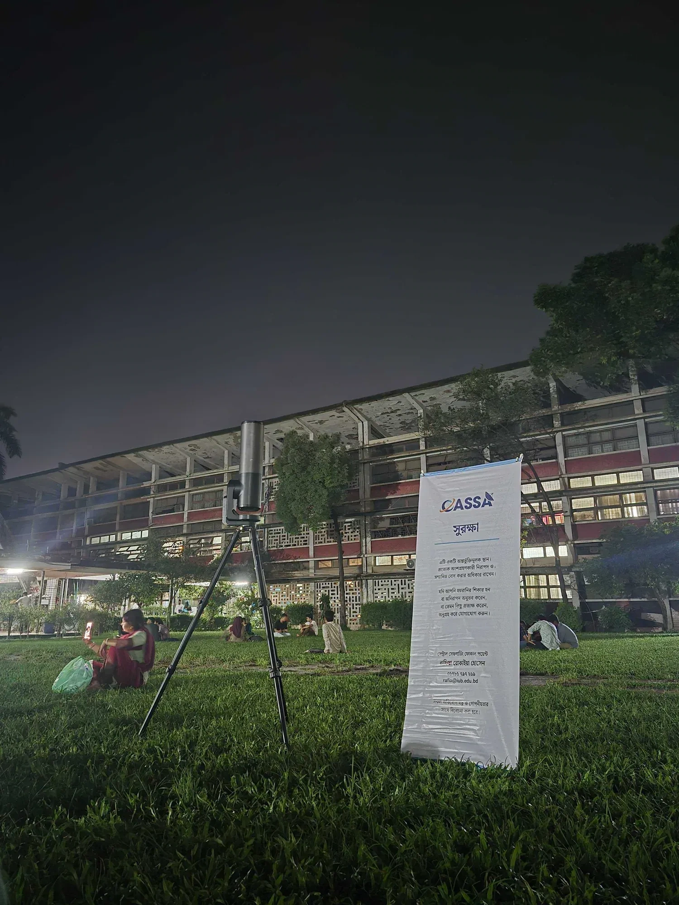
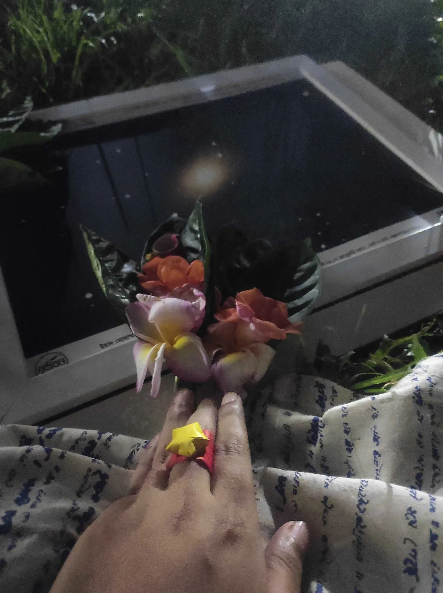
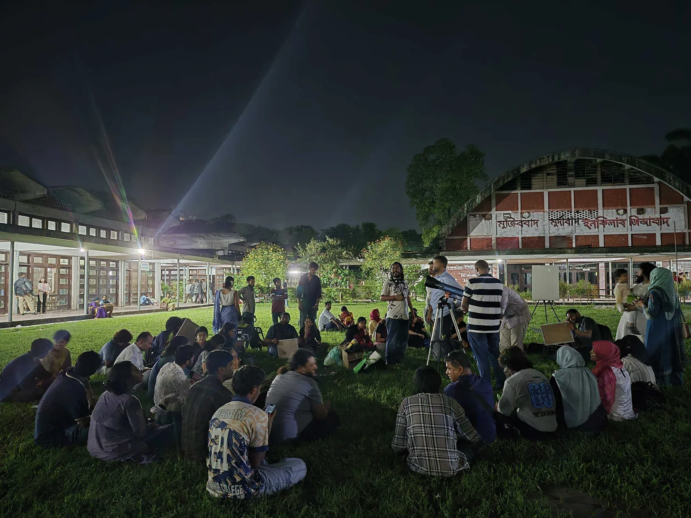
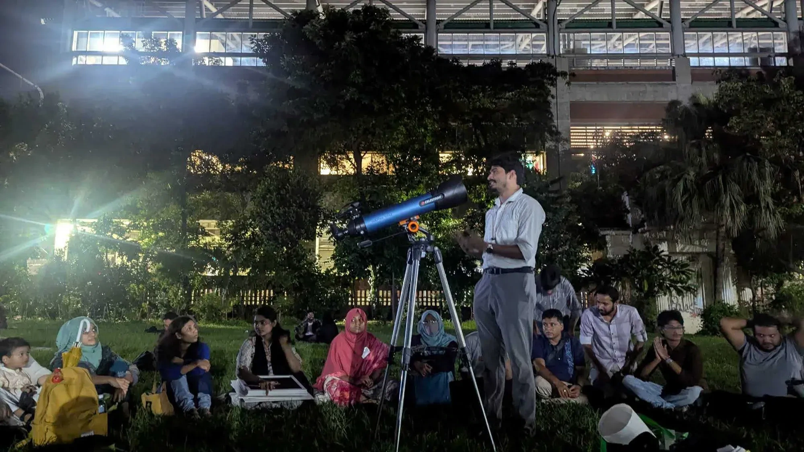
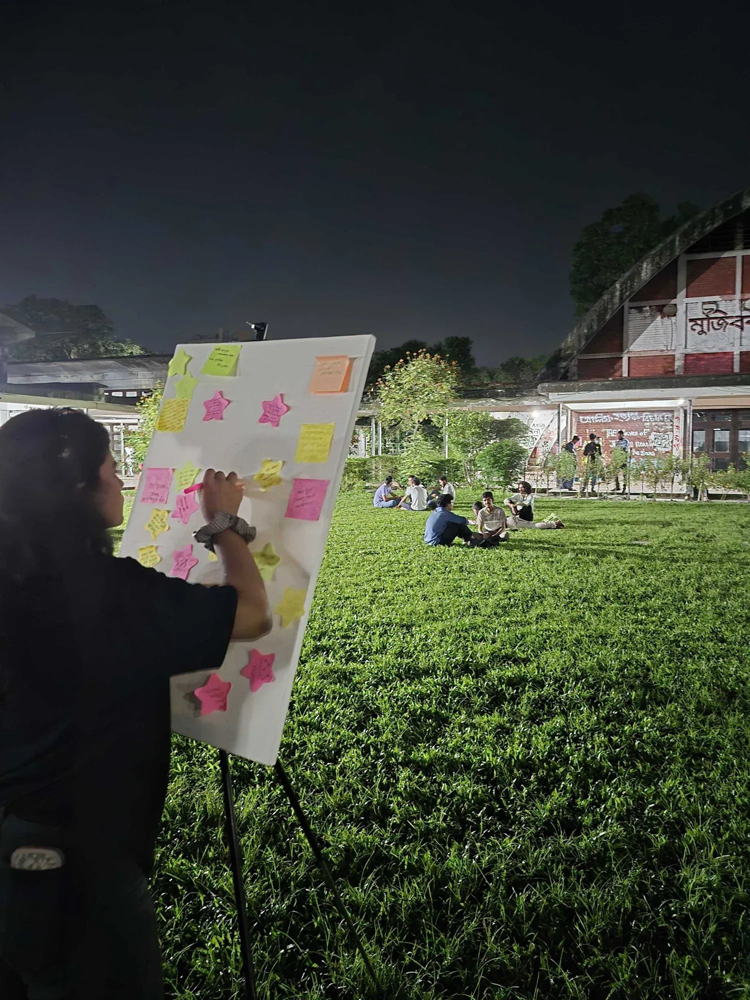
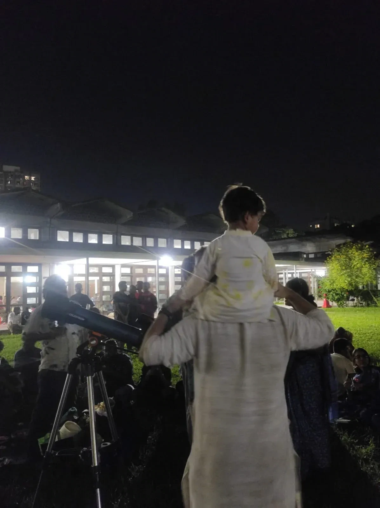

On 14 July, volunteers of Durbin, the astronomy outreach programme of the Center for Astronomy, Space Science and Astrophysics (CASSA), set out for the TSC grounds of the University of Dhaka carrying telescopes, astrophotographs, and the hope of introducing people to the wonders of the night sky through "Asman Jominer Golpo -  Porbo 1: Telescope-e Mohakash Dekha," organised in partnership with Bhoirobee.

The journey itself was anything but straightforward. After collecting the necessary equipment from CASSA, Adiba Habiba, Ayman Sheikh, Mozammel Hossain Masum, and Asmaul Husna Johana left around 5:30 p.m. Heavy traffic caused by HSC student demonstrations forced repeated detours, turning what should have been a short journey into an unexpectedly long one. By the time the team reached TSC, they were welcomed by Lima, the project's manager, fellow Durbin volunteer Tariqul, alumnus astrophotographer Shohan, and members of the Bhoirobee team. Throughout the preparations, Faisal, representing Bhoirobee, remained in close contact over the phone, helping coordinate the evening before greeting the team in person.

*Together on the TSC ground.*

Then came the moment everyone had been waiting for.

The Unistellar eQuinox (Ashwin-1) and the Celestron AstroMaster 100AZ were carefully assembled. Eyes slowly drifted upward.

Clouds here and there.

Not a single star.

Nothing.

*Waiting for the stars.*

For a programme built around looking at the sky, it could easily have ended there.

Instead, it quietly became something else.

More than thirty-five participants -young adults, elderly visitors, and even a curious child formed a circle on the grass. The Bhoirobee team welcomed everyone with handmade floral decorations and paper rings, setting a warm tone that felt less like a public event and more like friends gathering beneath a shared sky.

*A warm welcome, woven by hand.*

If the heavens would not reveal themselves, the universe would arrive another way.

Six astrophotographs captured by Durbin volunteers began making their way around the circle, passing from hand to hand. Nebulae, galaxies, planets, and distant star clusters - objects hidden above the clouds that evening appeared instead through photographs. People leaned in, pointed at details, asked questions, and imagined worlds hundreds or even thousands of light-years away.

Soon, the evening belonged not to the telescopes but to the people.

*Clouds above, stories below.*

One after another, participants stepped into the centre of the circle to share their own stories of the sky. Some remembered counting stars from the village yard as children. Others spoke of the Moon as an old companion that had followed them through different chapters of life.

One story lingered long after it was told.

*Where the sky met its storytellers.*

A participant recalled visiting Char Kukri Mukri in Bhola for the first time. Standing beneath an uninterrupted canopy of stars, he realised, as he described it, that "the sky was part of me, and I was part of the sky." It was that single night, he said, that sparked his fascination with telescopes and astronomy. Around the circle, heads nodded quietly. It was a reminder that science often begins not with equations, but with wonder.

*Every note, a dream of its own.*

The conversations flowed naturally into reflection. Participants wrote thoughts, memories, and dreams about the sky onto colourful sticky notes, gradually filling a large canvas with fragments of curiosity and imagination. By the end of the evening, the board had become its own constellation- each note a small story, meaningful on its own yet brighter together.

Traditional snacks such as nimki, kotkoti, batasha, and narkel-murki makha made their way around the circle as conversations continued. People posed beside the telescopes, despite never having looked through them, and the night concluded with everyone joining together to sing familiar Bengali songs about the sky, stars, and Moon.

There was something quietly beautiful about the irony.

The telescopes had travelled across the city only to spend the evening pointed at clouds. Yet the programme never felt unsuccessful. If anything, it reminded everyone that astronomy is not simply about observing celestial objects. It is about curiosity, conversation, and the shared human instinct to look upward and ask questions.

*Curiosity begins with looking up.*

As the gathering came to an end, many participants expressed a wish to return when the skies were clear. The Bhoirobee team shared that hope, looking forward to another evening where the stars themselves could join the conversation.

The Durbin team packed away the telescopes and finally returned close to 11:00 p.m. after another slow journey through the city's traffic. They had not shown a single star that night.

Yet somehow, no one left disappointed.

Sometimes, when the sky keeps its secrets, people discover that they have stories bright enough to share with one another instead.

This outreach event is a part of the Cosmic HerStory project.

Cosmic HerStory is supported by the British Council’s Women of the World (WOW) Bangladesh 2026 programme.
