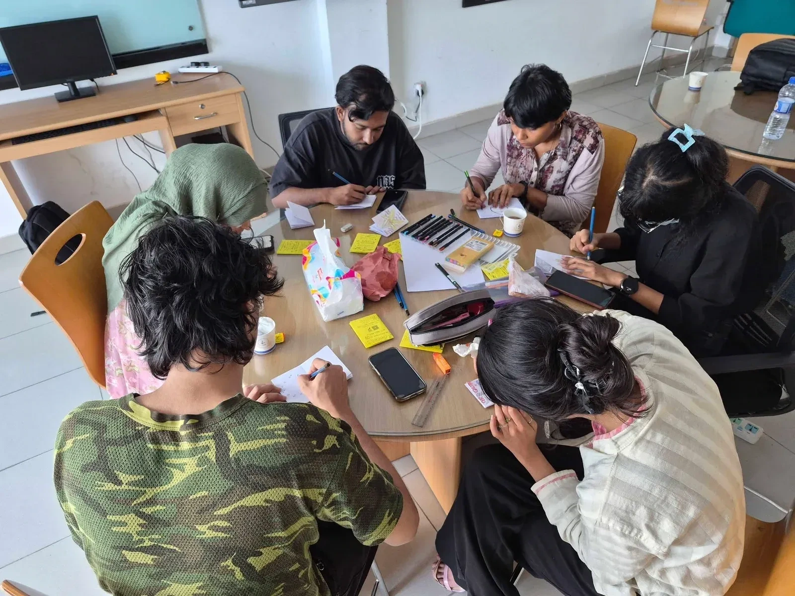
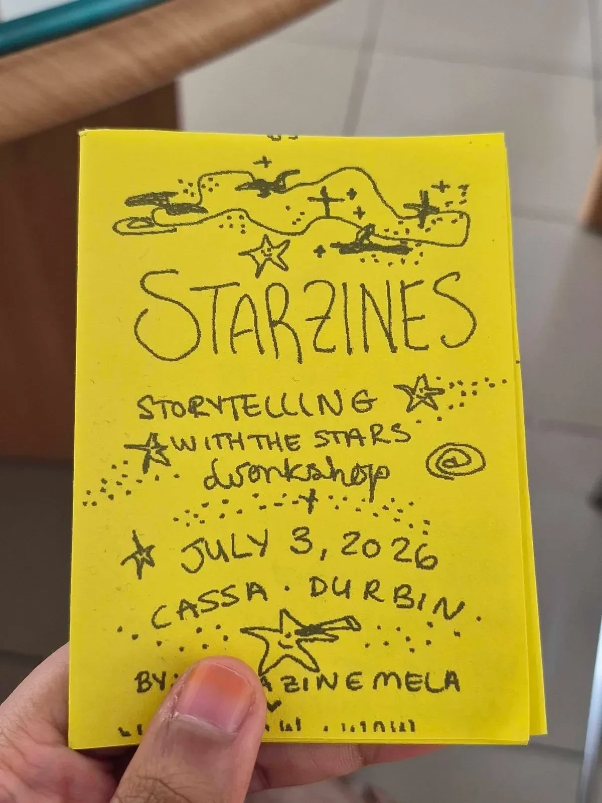
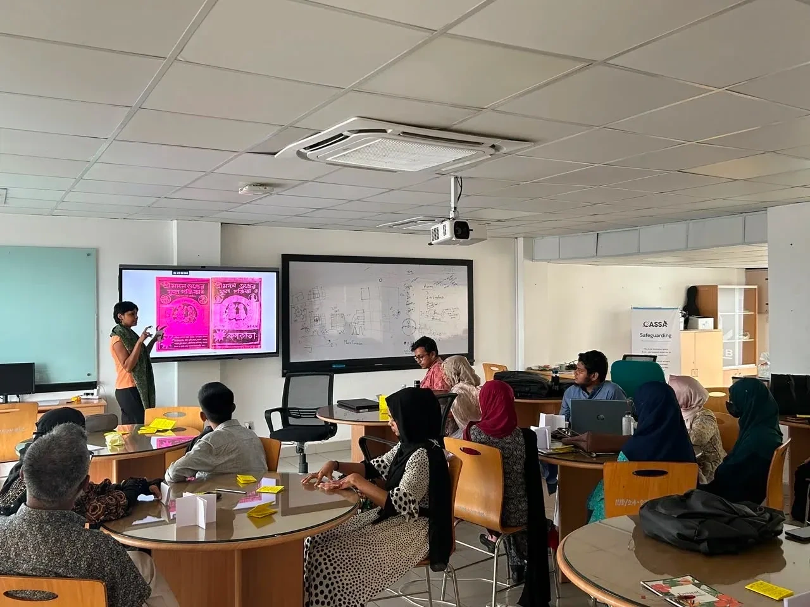
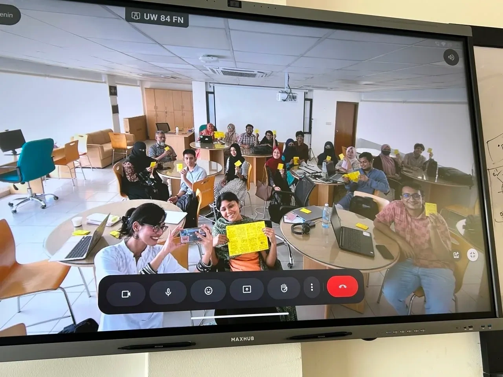

From July 3rd to 4th, the Center for Astronomy, Space Science and Astrophysics (CASSA) hosted Astrophotography Meets Zine Making, a two day workshop organized under the Durbin WOW project in collaboration with HerStory Foundation and Dhaka Zine Mela. Bringing together Durbin volunteers and participants across a wide range of age groups, the workshop opened up a space where science, art, and storytelling could meet in ways nobody in the room had quite tried before.

Leading the sessions were three instructors who each brought something different to the table. Anusha Alamgir, an educator and artist from Dhaka with an MA in Architecture from the Royal College of Art, came fresh off her recognition in Forbes 30 under 30 for Arts in Asia and an upcoming book, Things To Do Other Than Social Media. Alongside her was Katerina Don, a curator, author, and editor representing HerStory Foundation and Sister Library, and Senin Chowdhury, an educator, debater, and cultural organizer who works at the intersection of fashion and identity as Co Curator at Sister Library and founder of the fashion movement churigiri. Together, they opened Day 1 with a simple idea: there are no strict rules to creativity. Participants learned the basics of zine making through folding paper, playing with layouts, and letting their thoughts spill onto the page however they wanted.

*Day 1 was hands-on, folding paper, playing with layouts, and letting thoughts spill onto the page.*

*A finished "StarZines" cover from the workshop, carrying its creator's own perspective onto the page.*

Along the way, the instructors pulled from their own work to show what a zine could actually hold, everything from stargazing experiences and scientific curiosity to personal memories and small everyday moments. For many participants, the day became less about following instructions and more about slowing down, stepping away from screens, and reconnecting with something closer to childhood, that instinct to make something purely because it feels good to make it. By the end of Day 1, participants presented their finished zines, each one carrying its creator's own perspective and experiences, together proving the point that every story is worth telling.

Day 2 picked up right where the handmade creations left off, shifting focus from paper to pixels. Anusha led the Drawing to Digital session, introducing participants to digital tools, the fundamentals of digital zine making, and the varied approaches of different artists, before offering advice as simple as her opening line from the day before: play around and experiment freely. With that mindset, participants got to work turning their physical zines into digital booklets, while Anusha moved through the room offering feedback and nudging everyone to keep exploring rather than settle too early.

*On Day 2, the Drawing to Digital session moved participants from folded paper to digital tools.*

The workshop wrapped up with participants sharing their finished digital zines and reflecting on two days that had taken them from folded paper to finished screens. None of it would have come together without the team working behind the scenes, with a well earned shoutout going to the project manager and outreach ambassador, who stayed present throughout and kept everything, and everyone, connected. As Astrophotography Meets Zine Making comes to a close, the team is already looking ahead to seeing these creative works showcased at the Durbin WOW exhibition this August.

*Participants hold up their finished zines, creative works headed for the Durbin WOW exhibition this August.*

*Written by Farhana Ferdous*

*Instructors: Anusha Alamgir, Katerina Don, and Senin Chowdhury.*

*Organized by the Durbin team: Farzana Akter Lima (Project Manager) and Ashratul Zannati Purnota (Outreach Ambassador).*

*Participants: Tasnin Ara, Rownok Shahriar, Jhara Rani Saha, Most. Maftahul Zannat, Amena Basher Chowdhury, Tanzila Tabassum, Shanjida Nahar, Mahjan Sabibia Aban, Aiman Sheikh, Mohammed Tariqul Islam, Md Munem Shahriar, Mst. Sakina Sultana, Tasnim Mahfuz Nafis, Md. Abdullah Basher Chowdhury, Fahmidul Hasan, Md. Imrul Basher Chowdhury, Badrunnahar, Tashnim Elahi Tisha, Sheikh Fahim Haque, Mozammal Hossain Masum.*
