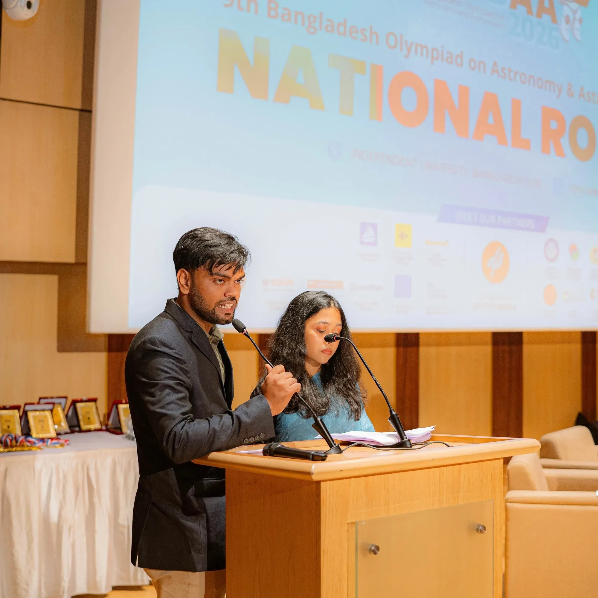
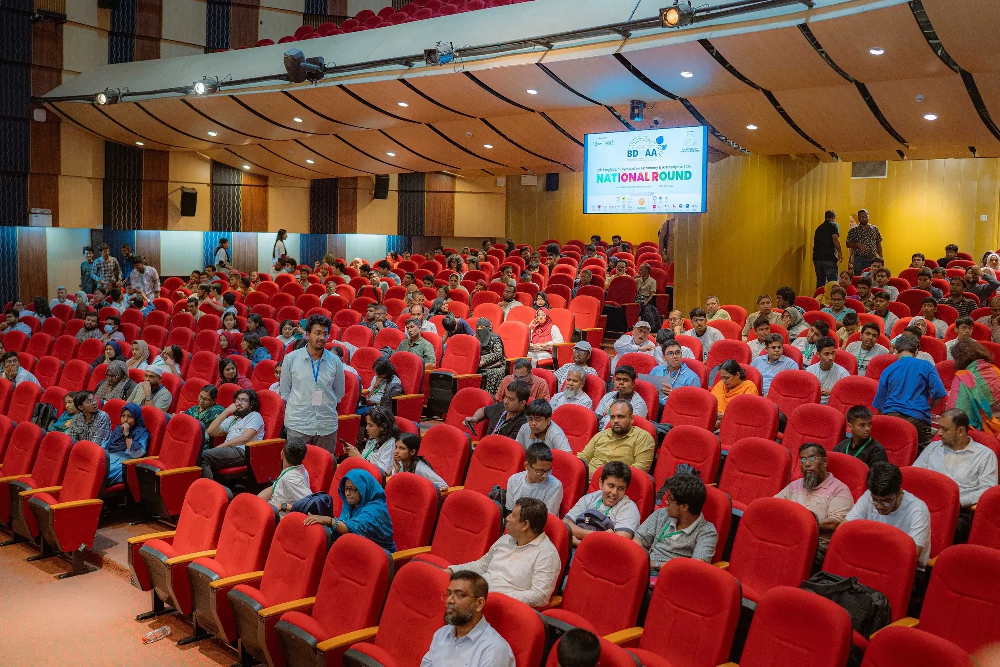
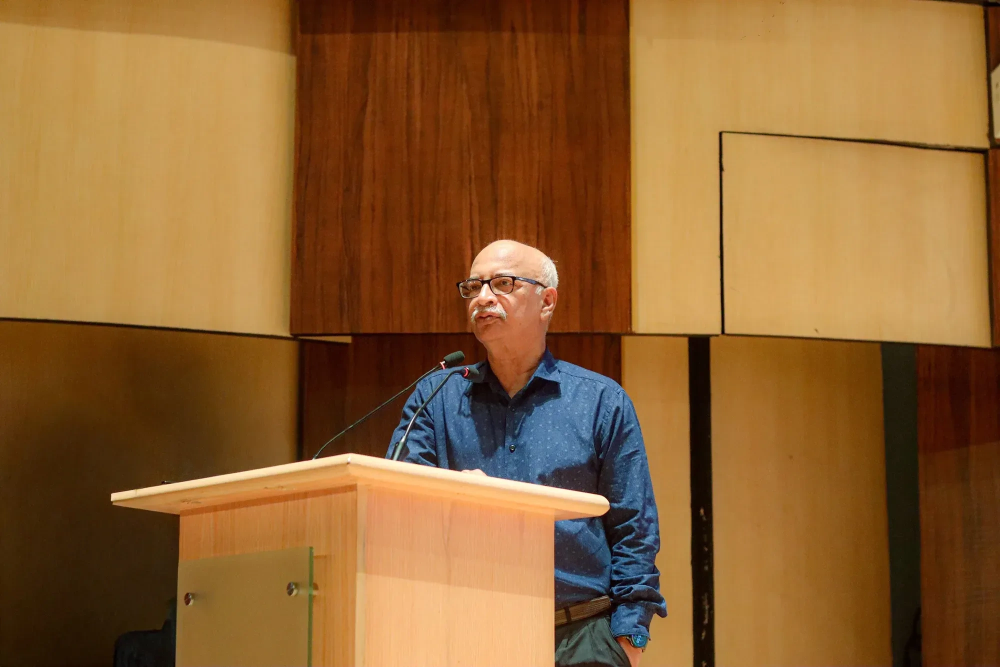
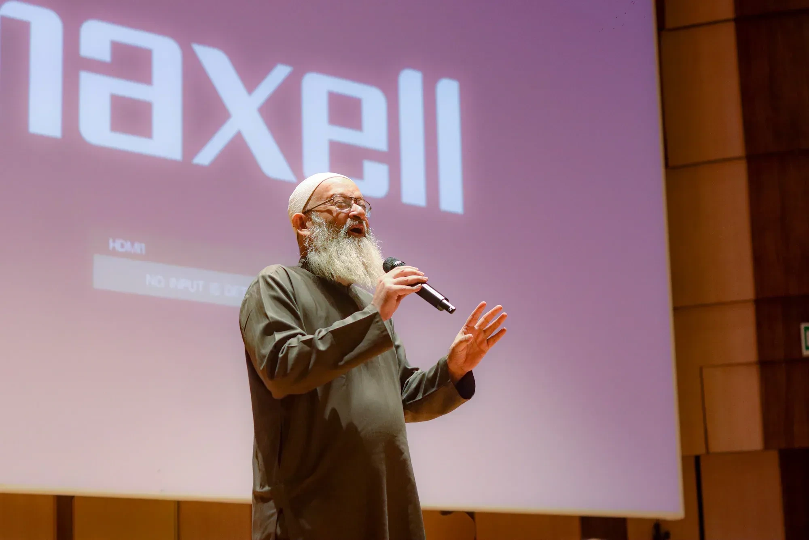
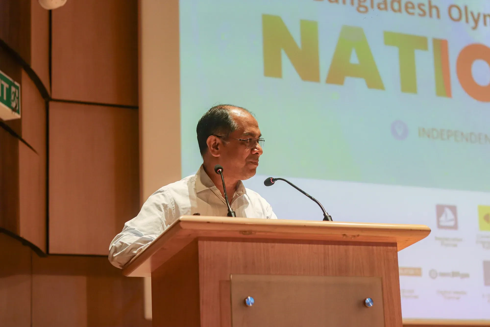
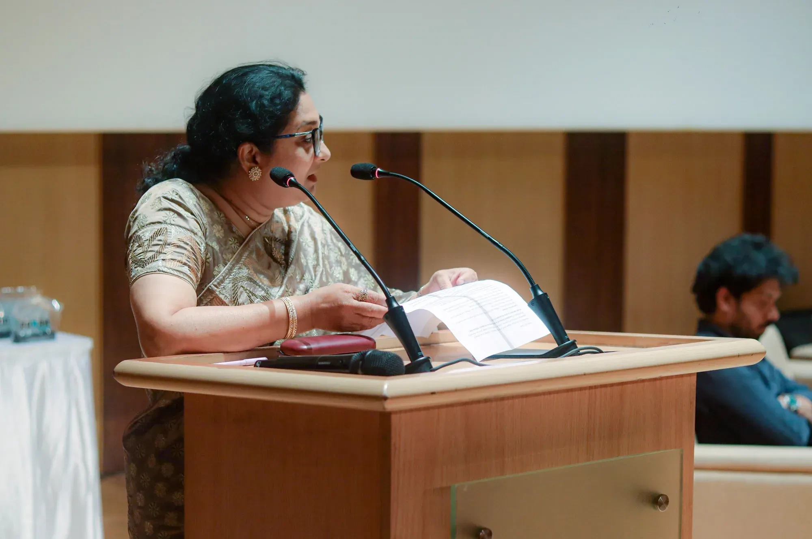
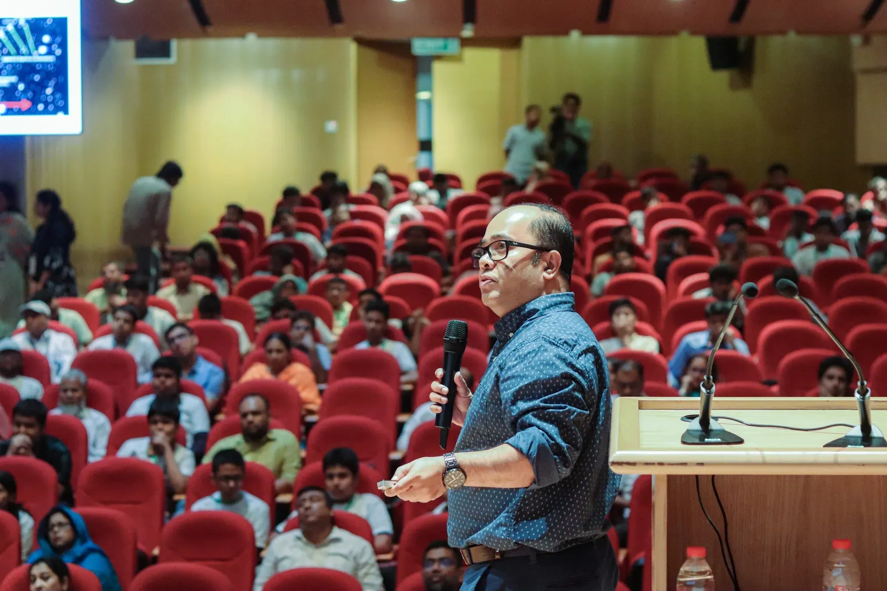
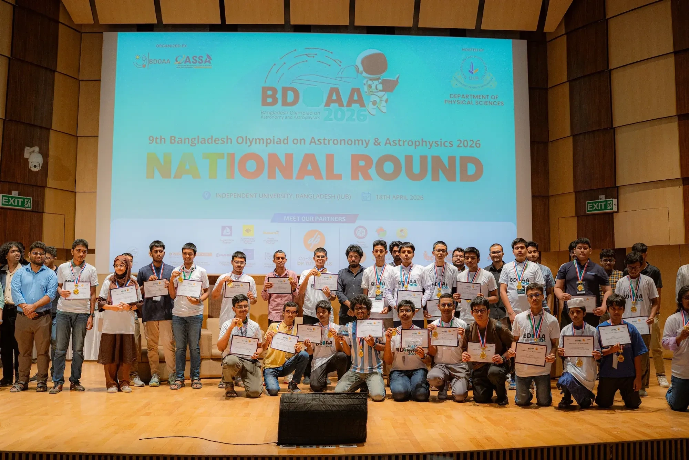

The quest for the cosmos reached a fever pitch on April 18, 2026, as the Independent University, Bangladesh (IUB) hosted the grand National Round of the 9th Bangladesh Olympiad on Astronomy and Astrophysics (BDOAA). From the early morning hours, the campus was abuzz with energy as participants from seven different regions, including Dhaka, Chattogram, and Khulna, reported at 7:30 AM to begin a day that would test their intellectual mettle and passion for the universe. Organized under the Bangladesh Olympiad on Astronomy and Astrophysics which is an outreach program of CASSA, the Center for Astronomy, Space Science and Astrophysics at IUB, this event served as the definitive platform for selecting the national team that will represent Bangladesh in Hanoi, Vietnam, later this year. The day was meticulously structured around 14 distinct activities designed to evaluate the students’ theoretical depth and practical observational skills, marking a significant milestone in the country’s burgeoning scientific landscape.

The heart of the competition began at 8:30 AM with the high-stakes Olympiad Exam, which stretched until 11:00 AM. This rigorous session was the core of the 14 specialized activities held throughout the day, specifically designed to challenge the analytical skills and theoretical knowledge of students across the Junior, Senior, and Open categories. These young aspirants, who had already cleared the hurdles of regional and e-regional rounds, found themselves immersed in complex problem-solving that spanned from celestial mechanics to galactic evolution. While the morning was dedicated to the quiet intensity of the examination halls, the afternoon transitioned into a more collaborative and forward-looking atmosphere. Participants engaged with various event stalls and attended an “Exclusive Study Abroad Workshop” by DP Tutorials from 11:30 AM to 12:30 PM, which provided them with a global perspective on how to navigate academic paths in STEM fields beyond national borders.

As the sun began to dip, the focus shifted to the Closing Ceremony at 4:45 PM, held in a packed auditorium where anchors welcomed an eager audience of students, parents, and faculties (Figure 1 & 2). The event was graced by high-level academic figures who emphasized that space science is not just an academic pursuit but a critical pillar for the nation’s technological future. Vice Chancellor Professor M. Tamim (Figure 3) delivered a stirring keynote address, commending the students for their bravery in tackling the mysteries of the infinite. This sentiment was echoed by Dr. Habib Bin Muzaffar (Figure 4), the Acting Dean, and Prof. Arshad Momen (Figure 5), Director of the Office of the Graduate Studies, Research and Industry Relations (GSRIR), who both spoke about the interdisciplinary nature of astrophysics and its power to inspire innovation. Dr. Rifat Ara Rouf (Figure 6), Head of the Department of Physical Sciences, also addressed the gathering, and congratulated the fellow participants for their unwavering determination to learn about the cosmos.

*Figure 1: The anchors welcoming guests to the Closing Ceremony of the 9th BDOAA National Round.*

*Figure 2: A packed auditorium of students, parents and faculty at the Closing Ceremony.*

*Figure 3: Keynote address by the Vice Chancellor, Professor M. Tamim.*

*Figure 4: Address by the Associate Professor and Acting Dean, Dr. Habib Bin Muzaffar.*

*Figure 5: Address by the Director of GSRIR, Prof. Arshad Momen.*

*Figure 6: Address by the Head of the Department of Physical Sciences, Dr. Rifat Ara Rouf.*

The evening continued with a series of enlightening sessions that bridged the gap between complex academic theory and public fascination. Syed Ashraf Uddin (Figure 7) captivated the audience with a public talk titled “How fast is the universe expanding?” where he broke down the complexities of Hubble’s Law and the accelerating cosmos into relatable concepts. The talk was followed by a brief but lively Q&A session, where students poked and prodded at the boundaries of current cosmological understanding. Following this, Dr. Khan Muhammad Bin Asad took the stage to offer a formal vote of thanks to the organizers, volunteers, and participants. During his remarks, he also briefly spoke about the much-anticipated astronomy night scheduled for later that evening, inviting everyone to transition from the theoretical discussions of the auditorium to the practical wonders of the night sky.

*Figure 7: Syed Ashraf Uddin delivering the public talk “How fast is the universe expanding?”*

The most anticipated moment of the day arrived at 5:40 PM with the Prize Giving Session, a ceremony that transformed the auditorium into a scene of triumph and celebration. The stage saw a parade of brilliant young minds, with winners from the Senior Category and the Junior Category (Figure 8) stepping forward to receive their well-deserved medals and certificates. These students had emerged as the best from a competitive pool that began with regional rounds in late 2025 and a massive online e-regional round in March 2026. Beyond the physical awards, these winners now carry the responsibility of representing the collective scientific ambition of Bangladesh. They are no longer just students; they are the selected few who will carry the national flag to the international stage in Hanoi, proving that Bangladeshi talent is ready to compete with the finest young astronomers in the world.

*Figure 8: Winners of the BDOAA National Round, Junior Category.*

To conclude the day’s festivities, the BDOAA partnered with Durbin, a national astronomy outreach program under CASSA, which has a mission: bring the wonders of the universe to everyone through astrophotography and clear science communication. As night fell, the event moved to the rooftop of IUB’s main academic building for the celebratory “Astronomy Night 14.” Starting at 7:00 PM, participants and visitors gathered at the CASSA premises for a session that allowed a closer look of the cosmos. Participants enjoyed both digital and optical stargazing, operating under the guiding philosophy that astronomy should always be experienced and not just studied. Through high-powered telescopes and sophisticated digital mapping tools, Durbin provided a hands-on experience that allowed students to apply the day’s theoretical learning to the actual, sparkling canvas of the night sky, turning abstract equations into visible constellations.

The 2026 National Round of the BDOAA has once again proven to be more than just a competition; it is a true “festival of science” that nurtures the next generation of Bangladeshi researchers and explorers. By integrating rigorous testing with public engagement and direct observation, IUB and CASSA have provided a holistic environment where scientific growth can flourish. As these young astronomers look toward the IOAA 2026 in Vietnam, they do so with a deeper connection to the cosmos and the confidence necessary to compete on a global level. With the continued support from partners, BDOAA remains a beacon for science education in the country, ensuring that the stars are never truly out of reach for the nation’s youth, provided they have the curiosity to look up to and the platform to learn.
