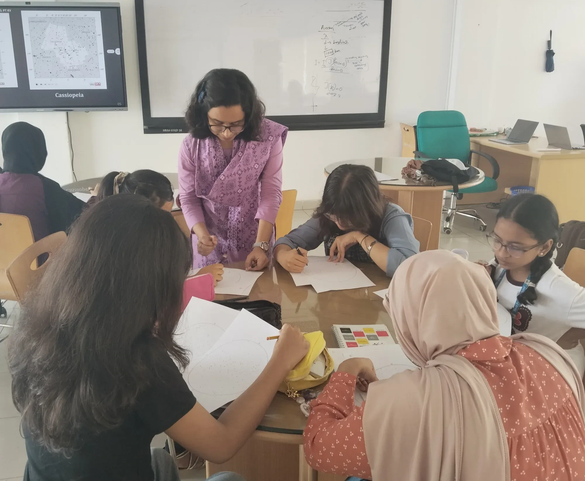
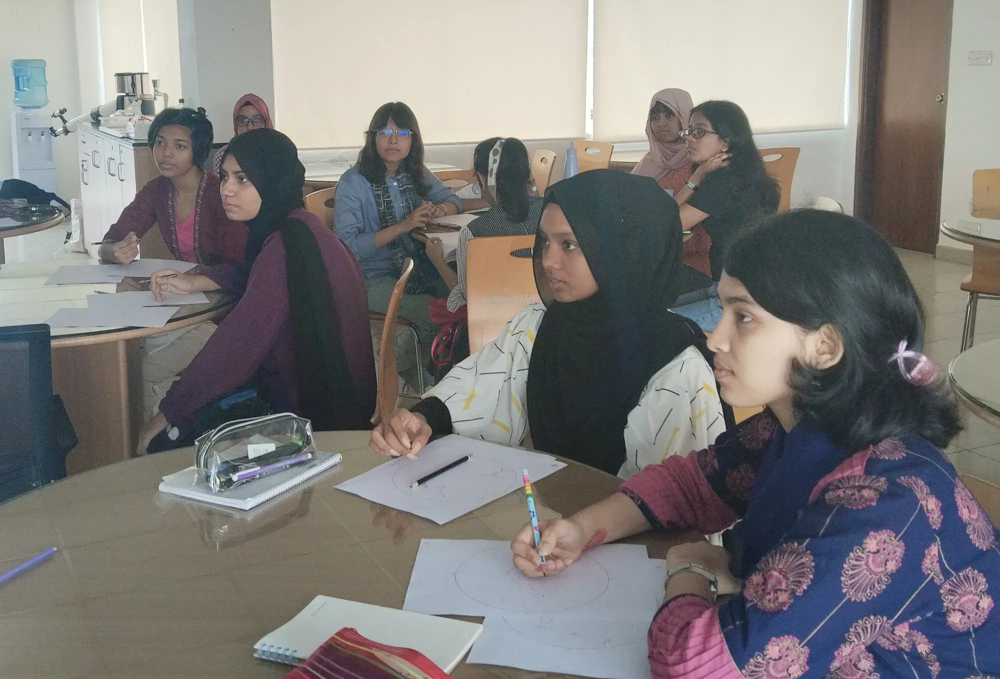
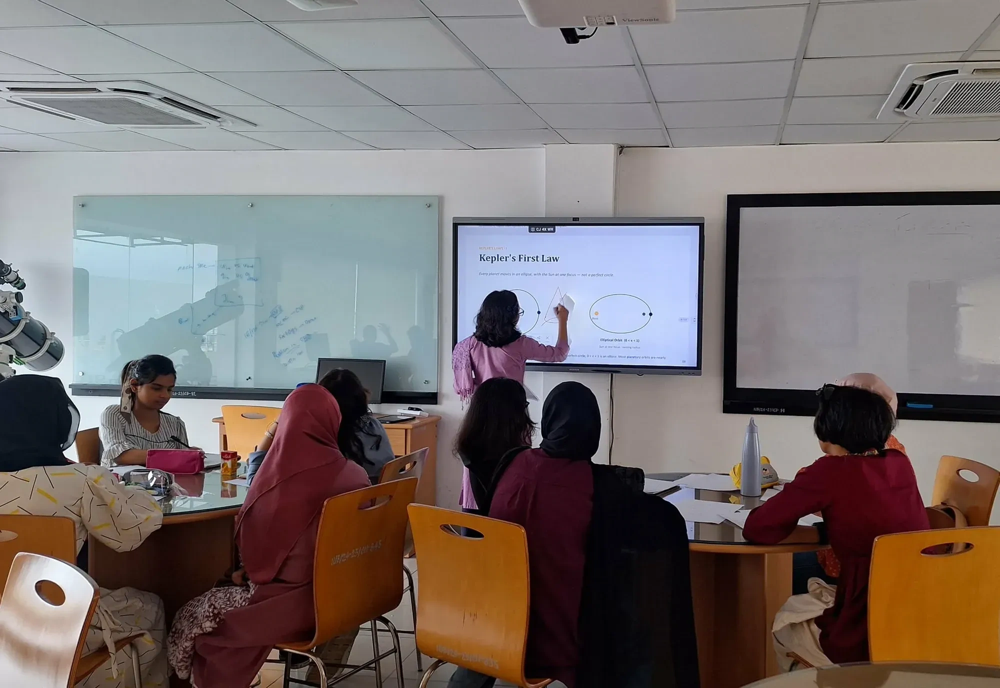
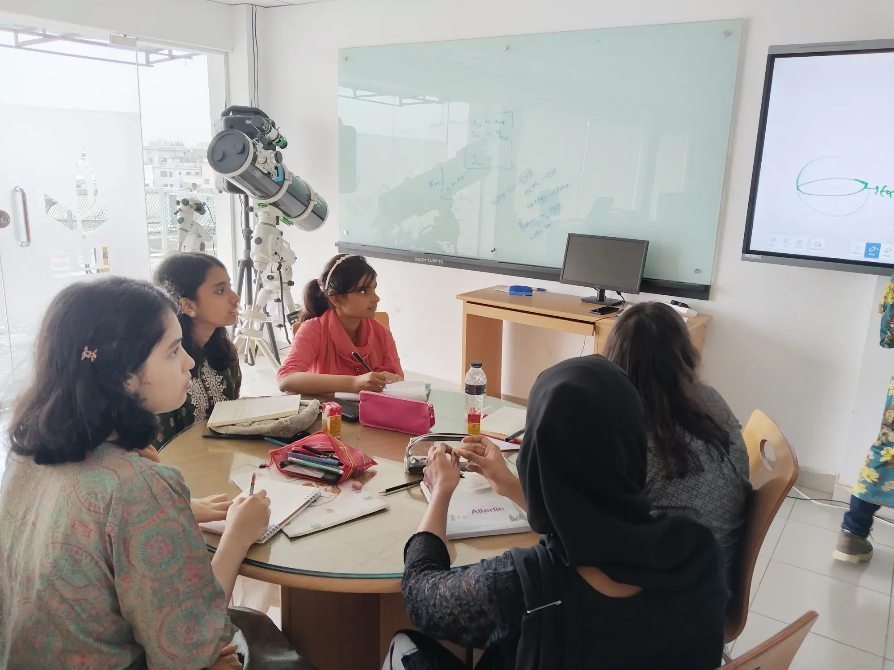
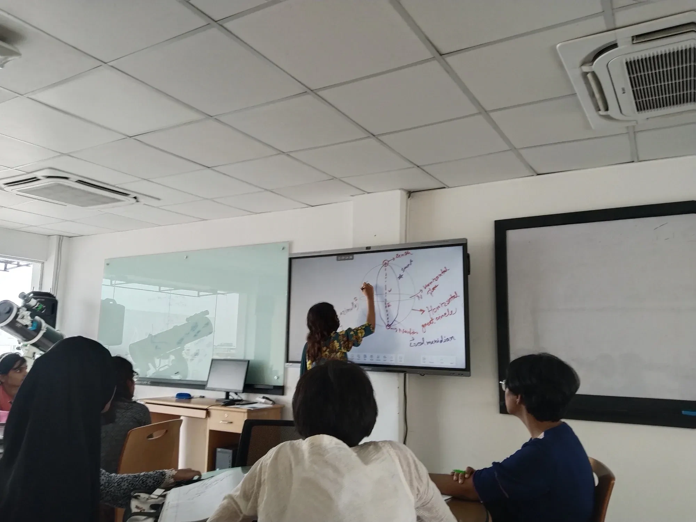
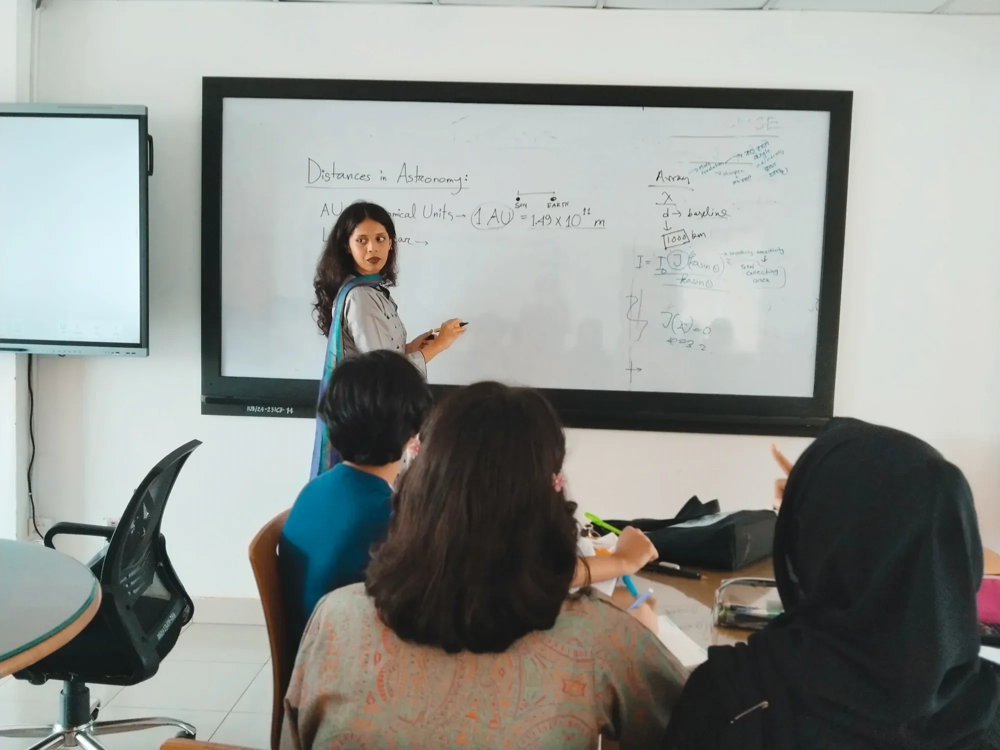

On July 10th and 11th, CASSA at Independent University, Bangladesh opened its doors to a free two day camp built entirely around one goal: giving girls in Classes 6 to 10 a real, hands on introduction to astronomy, both the kind you observe and the kind you calculate. Organized jointly by BDOAA and Durbin, the camp brought together instructors from four different universities to bridge the gap between raw curiosity and competitive astronomy, the exact kind that opens doors to international Olympiad stages.

*Working through real skymap problems, with Cassiopeia on the screen behind.*

Day one was led by Tahiatun Nahar Juthi, who opened with an orientation to BDOAA and walked participants through the competitive syllabus before diving straight into practice. Rather than just explaining what a skymap is, participants got their hands on real skymap problems and worked through them themselves, followed by a session on celestial mechanics where mathematical problems became a way of building genuine intuition for orbital motion and gravity, the kind of understanding that sticks longer than a memorized formula ever could. The morning also carried a moment built for inspiration rather than instruction: Faria Mahmud, Silver Medalist at IOAA Junior 2024, sat down with participants to share what competing on the international stage actually felt like.

*Skymap sheets, pencils, and constellations traced by hand.*

*Kepler's First Law, worked through on the board during the celestial mechanics session.*

The afternoon shifted gears with Labib Bin Azad of the University of Dhaka leading a session on observational astronomy and an introduction to cosmology, starting from something as fundamental as waves before opening up into the broader ideas that shape the field. By the time day one wrapped, participants had solved real skymaps, tackled real mathematics, and left with something harder to quantify: genuine excitement for what day two still had in store.

*A telescope stands beside the window through the theory sessions.*

Day two picked up the pace under Mohtasiba Hossain and Fairooz Shaira, taking participants deeper into the physics and mathematics that hold the cosmos together. The day opened with celestial coordinate systems, essentially learning the language astronomers use to navigate the sky, before moving into magnitude and what it actually means to measure the brightness of a star. After a lunch break, the focus turned to radiation mechanics, and the day closed with photometry, tying the morning's theory directly to how starlight gets measured in practice.

*Zenith, nadir, azimuth and the local meridian, the language astronomers use to navigate the sky.*

*Putting a number to the astronomical unit.*

By the time the two days wrapped, the camp had done exactly what it set out to do: participants left with sharper mathematical intuition, hands on experience with real astronomical problems, and a clearer sense of what a path toward Olympiad astronomy could actually look like. For a program built specifically to introduce girls to a field they are too often left out of, that combination of skill and inspiration is precisely the point, and precisely why camps like this one matter well beyond the two days they run.

Cosmic HerStory is supported by the British Council's Women of the World (WOW) Bangladesh 2026 programme.

*Organisers: Ahmed Al Imtiaz, Ashratul Zannati Purnota*

*Participants: Tasfia Jahan Chowdhury, Zarin Afrin Karim Rida, Amena Basher Chowdhury, Maisha Mehjabin, Manha Bintay Islam, Wafaa Khan, Ethika Shahid, Mubashira Islam, Namuna Ghosh, Khandaker Anaranya Tanveen, Raisha Ahamed Roza*
