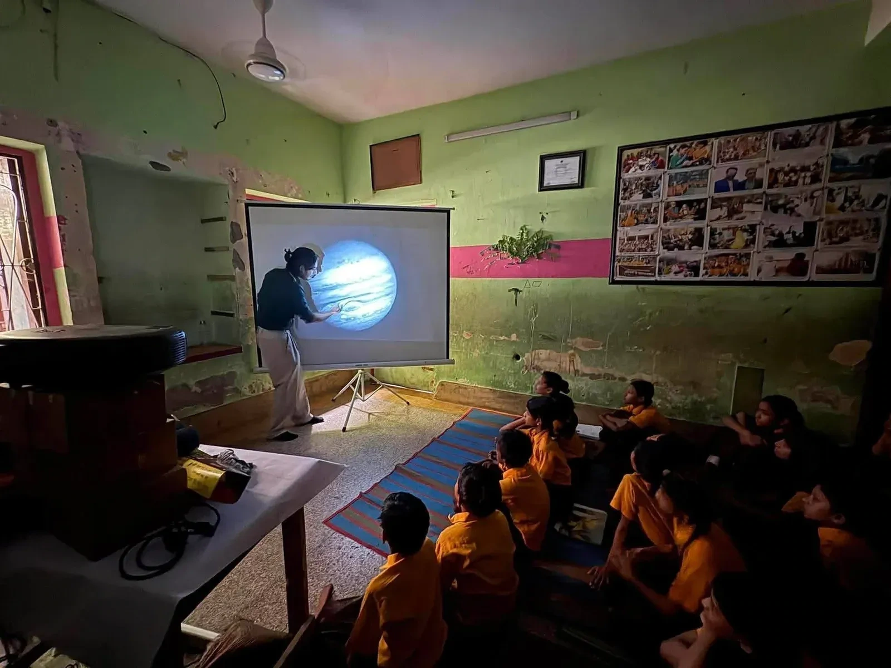
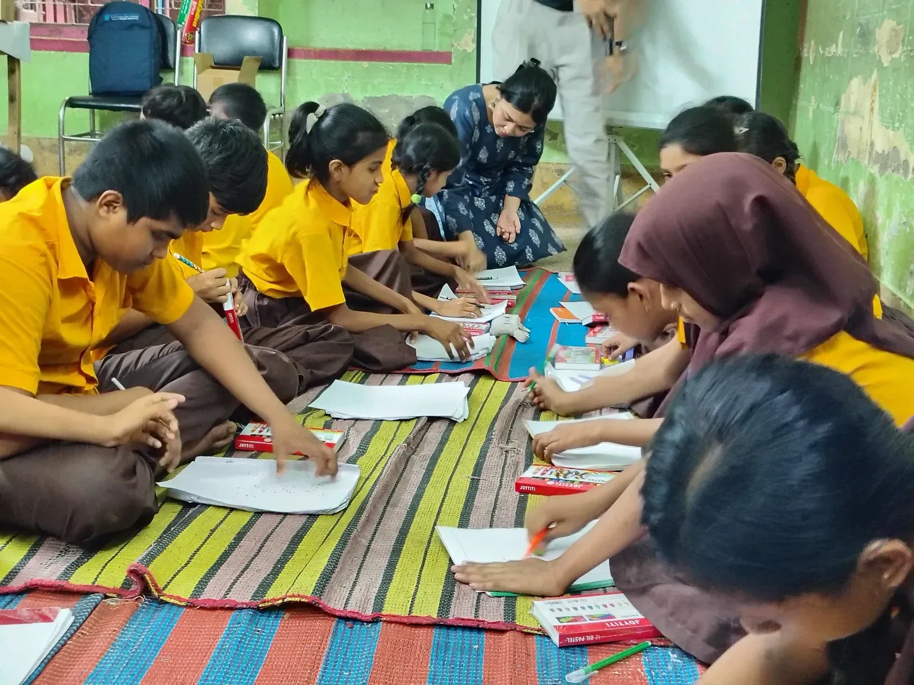
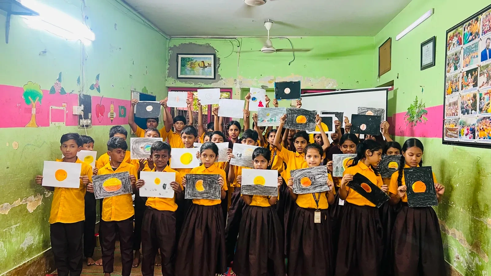
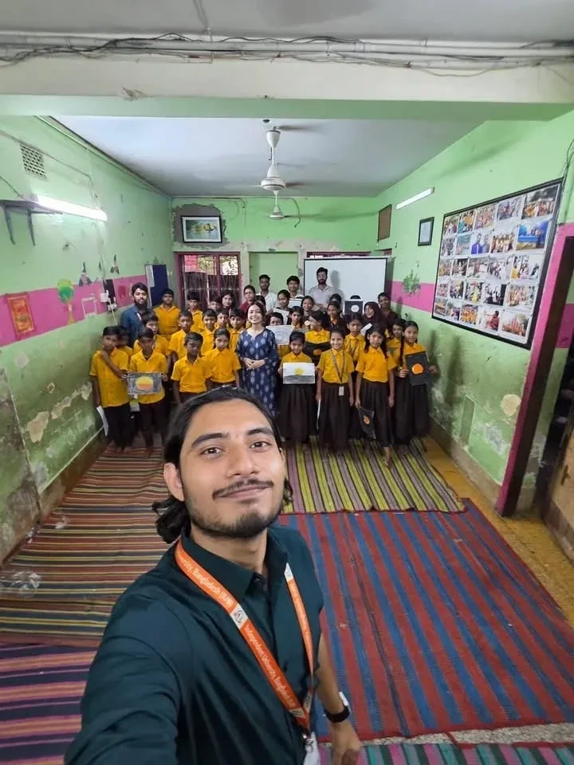

On June 29, a small team from Durbin, CASSA went to Chayatol school for an astronomy outreach session, and for many of the children there, it wasn't just a new subject. It was a first introduction to the idea that there's a universe out there worth wondering about. Three instructors, Imtiaz, Shahal, and Farhana, led the day. Imtiaz opened the session the smart way: not with facts, but with the sky itself, pointing out shapes the students could recognize even through the clouds. From there, a video zooming out from everyday objects to the largest structures in the cosmos took over, and suddenly planets, moons, stars, and galaxies weren't abstract vocabulary anymore. They were something the students could picture, scale by scale, all the way up to the humbling realization of just how small we are against it all.

Once that sense of scale had settled in, Imtiaz shifted gears and introduced Durbin, CASSA's volunteer astronomy outreach programme, and the broader mission behind it, using astrophotography and science communication to bring the universe a little closer to people who rarely get the chance to look up through a telescope. It set the stage perfectly for what came next: Shahal took over and shared his own astrophotography, images of the Moon, a lunar eclipse, and distant galaxies, all captured right from Bangladesh, proof, for many of the students, that this wasn't something that only happened somewhere else. The room lit up further when he pulled three students up front to act out the Sun, Earth, and Moon, letting them physically walk through how one hides the other during an eclipse instead of just hearing it explained.

*That red swirl on the screen is a storm wider than the Earth, and it has been raging for centuries. Nobody was blinking.*

After a short lunch break, Farhana took the room in a different direction entirely. She introduced the day's practical activity, drawing anything that felt connected to the sky, whether that meant planets, moons, or the night sky as seen from the ground, and used the idea of constellations to explain how the brain naturally conjures shapes out of scattered stars. When she mentioned seeing an elephant in the sky, it set something off. Students started calling out their own shapes almost immediately: dogs, apples, books, birds, foxes, and plenty more, each one a small proof that their imaginations had latched on.

*Students draw whatever felt connected to the sky, planets, moons, and constellations of their own making.*

*By the end of the activity, the room was full of hand-drawn Suns, eclipses, and open skies.*

That eagerness ran through the whole session. The students asked their own questions without hesitation, jumped into discussions, and treated a completely unfamiliar topic like something they already belonged to. For a team hoping to spark curiosity rather than hand out facts, it was exactly the response they'd hoped for, proof that science communication works best when it invites people in rather than lecturing at them.

Shahal put it best afterward: outreach isn't just teaching, it's connecting, showing people that the universe belongs to all of them, regardless of where they started. Watching the students' drawings of the Moon, stars, and open sky take shape by the end of the day was a reminder that curiosity doesn't check anyone's background before showing up. The team left Chayatol with full hearts, already looking forward to the next classroom where the sky would get to do the same thing all over again.

*The team left Chayatol with full hearts, already looking forward to the next classroom.*

*Written by Farhana Ferdous*

*Present at the event: Md. Shahadat Hossain Shahal, Ahmad Al-Imtiaz, Farhana Ferdous.*
