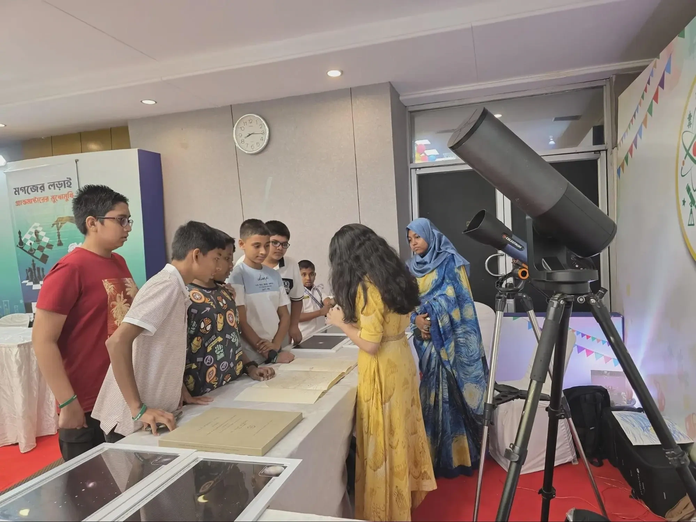
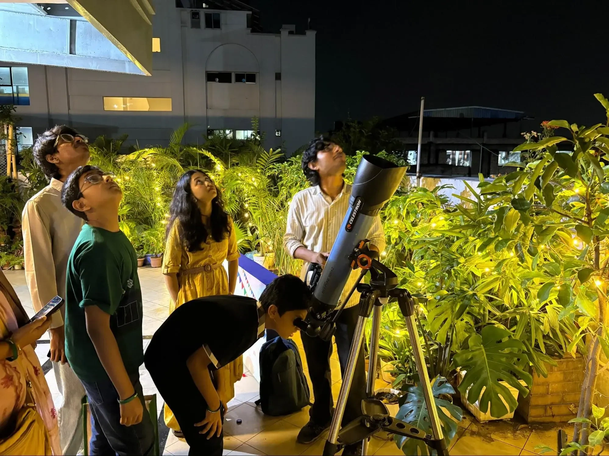

The ACI Center in Tejgaon buzzed with intellectual energy last Sunday as the ACI Medhabi Carnival celebrated the achievements of primary-level winners from across Bangladesh. Organized by the ACI Adommo Medhabi program, the event provided a unique space for students to explore their academic passions beyond the classroom. A central feature of this year’s carnival was a special collaboration with the Durbin team, a national astronomy outreach program of the Center for Astronomy, Space Science and Astrophysics (CASSA) at Independent University, Bangladesh (IUB). Durbin is dedicated to introducing the wonders of the universe to the public through astrophotography and science communication.

At the heart of the activity, the Durbin team set up an immersive astronomy booth. The display featured stunning frames of the Orion Nebula and star clusters captured by Durbin’s astrophotographers. A unique highlight was the "Isaac Roberts' Atlas of 52 Regions: A Guide to Herschel's Fields of Nebulosity," a historical artifact gifted to CASSA. The presence of this atlas allowed students to compare the intricate methods of ancient astrophotography with the digital capabilities of the present day. Young enthusiasts gathered to examine the specialized photographic plate book, while the team answered a wide range of questions about the constellations, as captured in **Figure 1**. This hands-on interaction allowed students to see astronomical data up close, bridging the gap between textbook theory and practical discovery.

*Figure 1: Durbin volunteers explaining the process of using digital telescopes (Unistellar eQuinox).*

Beyond the exhibition, the Durbin team played a vital role in the academic challenge segment of the carnival. The Durbin team contributed to the question-making process, designing three rigorous astronomy problems. Participants were tasked with identifying lunar eclipses from diagrams, locating Polaris (the North Star) in the night sky, and analyzing the effect of gravity on a falling feather and rock in different environments,Earth, the Moon, and in space. These challenges encouraged students to apply scientific principles to complex cosmic phenomena, further refining their critical thinking skills alongside traditional subjects like math and robotics.

*Figure 2: Stargazing session with an optical telescope (Celestron Inspire 100AZ).*

The carnival also featured a variety of other intellectual engagements, including Sudoku games, Rubik’s cube challenges, and a math and science quiz. A significant highlight was the simultaneous chess exhibition, where students competed against Bangladeshi Grandmaster Rifat Bin Sattar. This rare opportunity allowed young players to observe professional strategy firsthand. One participant shared, "Playing against a Grandmaster was a new experience for me. It was interesting to see how quickly he moved between the boards while keeping track of every game."

As night fell, the event reached a celestial conclusion with a captivating stargazing session using a Celestron Inspire 100AZ telescope, as shown in **Figure 2**. Guided by the Durbin team, children and parents used the equipment to observe celestial bodies directly, bringing their earlier discussions to life. One attending parent remarked that the initiative provided a "good balance between fun and intellectual engagement". The carnival wrapped up with a prize distribution ceremony, honoring the winners of the day's various challenges and solidifying the students' passion for scientific exploration.

*Written by Farhana Ferdous*
