Marking the official launch of Durbin 2026, Durbin Workshop 2 convened at CASSA, IUB, from January 15 to 17, 2026. This gathering brought together a diverse cohort of twenty students representing eight universities across Dhaka, Chattogram, and Pabna, including AIUB, BracU, CU, Edward College, IUB, Jagannath, SEU, and UIU. Supported by a British Council grant dedicated to empowering women as astrophotographers and science communicators, the workshop emphasized gender inclusivity, achieving a 65% female participation rate. Building on the legacy of the previous year, four alumni volunteers returned to participate, and by the event's conclusion, fourteen promising attendees were selected as the new ‘Volunteer Applicants’ for the upcoming cycle. The full list of attendees is available on the event page.

The three-day curriculum comprised ten distinct sessions designed to foster both theoretical knowledge and practical skill. The agenda balanced five expert lectures led by Dr. Khan Asad with four collaborative workshops, where participants were divided into five teams to tackle hands-on challenges; these efforts culminated in a final session of group presentations. The program was orchestrated by Project Manager Farzana Akter Lima with support from CASSA Science Manager Muhammad Jobair Hasan, while the specialized astrophotography segments were instructed by Md Shahadat Hossain Shahal and Yead Muhammad Ivan. Each session is described below in more detail.

## Day 1: Jan 15

### Session 1: Introduction to Durbin 2026 (10:30 - 12:00)

Khan Asad opened the session by outlining the [history of CASSA](https://cassa.bd/about/) since its inception in 2020 and its profound link with the Durbin program. The initial concept for CASSA began in 2020 when Asad joined IUB and founded the Astronomy Research Group, IUB (ARGI), which received early support from IUB and the ICT Division of the Bangladesh government. ARGI's achievements, including publications and the expansion of the Introduction to Astrophysics course, established IUB as the only university in Bangladesh with a significant presence in observation-intensive astrophysics. This success attracted the attention of Durbin founder Dr. Lamiya Mowla, then a postdoc at the Dunlap Institute, University of Toronto, who was looking to utilize her Dunlap seed grant for astronomy research and outreach in Bangladesh. After her 2022 visit to IUB and her invitation for Asad to visit Dunlap, the Durbin plan was formalized during Asad's visit to Dunlap in November 2022. This effort culminated with the delivery of two Unistellar small telescopes in February 2023 and the official inauguration of Durbin on March 9, 2023, at the IUB auditorium, attended by Dr. Mowla and about a thousand people. Rukaiya Binte Rashid was named Durbin's first project manager. That same year, IUB introduced a minor in astronomy and astrophysics, and ARGI installed a computing server, which led to its renaming as the Computational and Observational Astronomy Lab (COALab).

As Durbin's activities continued throughout 2023 with over a dozen volunteers, Asad, Mowla, and Momen secured seed funds through an IUB Sponsored Research Grant (applied for in 2022) to establish a campus observatory. Although the lack of funds prevented the observatory's construction, Durbin's activities, particularly the 'Astronomy Nights,' significantly boosted IUB authorities' enthusiasm for astronomy. By August 2024, six Bangladeshi astronomers and astrophysicists based in the USA and Canada were actively supporting the idea of founding a dedicated research center. At the request of the IUB Board of Trustees, Asad, as the principal proposer, submitted a detailed proposal for CASSA with 10 co-proposers. The proposal was officially approved on August 14, 2025, marking the start of CASSA. Thus, the history of CASSA is intrinsically linked to Durbin, which was officially ratified as CASSA's outreach program on the same date.

The Dunlap funding sustained Durbin until 2025. Nearing the end of that year, Durbin volunteer Farzana Akter Lima identified and brought a British Council grant opportunity to CASSA's attention. Under the supervision of Lamiya Mowla and Syeda Lammim Ahad, Lima authored and submitted a proposal to the British Council for the WOW (Women of the World) Bangladesh Chapter 2026 grant, with CASSA as the applicant and Lima as the main contact person. Following the grant's acceptance and the agreement signing on December 22, 2025, Lima was appointed Project Manager of Durbin, effective January 4, 2026.

The designation of the new program as Durbin 2026 is based on three core innovations. First, Durbin is transitioning from a purely volunteer-led activity with minimal expert input to one where volunteers will receive continuous training, supervision, and evaluation directly from expert astrophysicists, including Dr. Lamiya Mowla, Dr. Syeda Lammim Ahad, Dr. Syed Ashraf Uddin, and Dr. Asad. This new structure will extend the benefits of IUB's rigorous astronomy programs to students from other universities. Second, Durbin is shifting its focus from primarily event-driven outreach, where student volunteers with limited knowledge engaged the public, to producing astrophotographic images and learning materials contributed by volunteers for the website. This change ensures that the program creates lasting, globally accessible resources, a contrast to previous activities that did not generate permanent assets. Third, to address the previous failure to train an adequate number of women astrophotographers and science communicators, the new program,significantly supported by the WOW grant,is committed to training at least 10 women astrophotographers annually. These women will be expected to not only gain skills but also lead future imaging and science communication initiatives at the intersection of science and arts.

### Session 2: Seven ages of the universe (12:00 - 1:00)

To effectively train the Durbin volunteers, content from IUB courses is utilized directly. In this session, Asad presented the material from the IUB course [AST 100: Our Cosmic History](https://cassa.bd/abekta/courses/ast100) and connected it to the Durbin program. The course covers the universe's complete 14-billion-year history, structured into seven distinct ages. This material is particularly relevant to Durbin, as the program's name, *Dur Bishwer Nagorik* (citizens of distant worlds), aligns with AST 100's goal of situating humanity within the full scope of cosmic spacetime. A summary of the seven ages is provided below.

The universe's history is presented as an organized sequence of seven ages, each defined by the progressively increasing complexity of matter and the emergence of life. This cosmic journey is effectively mapped onto the flow of the international Brahmaputra river, where its passage from a high-altitude source to the expansive Bay of Bengal mirrors the universe’s own evolution from initial simplicity to advanced cultural sophistication. The timeline begins with the Particle Age, a period spanning the first 300,000 years, characterized by the Big Bang, cosmic inflation, and the initial formation of neutral atoms. This was followed by the Galactic Age, which lasted up to 4 billion years, during which the first stars and galaxies formed through hierarchical merging processes and the development of supermassive black holes.

Continuing the cosmic narrative, the Stellar Age represents the period of peak star formation and nucleosynthesis, processes that enriched the universe with the heavy elements essential for future complexity. This set the stage for the Planetary Age, occurring between 9 and 11 billion years, marked by the formation of our solar system and the stabilization of Earth into a solid world. The Chemical Age followed, defined by the synthesis of prebiotic molecules and the emergence of the first prokaryotic cells. This biological groundwork then led into the Biological Age, spanning from 13 to 14 billion years, a time that witnessed the Cambrian explosion, the colonization of land, and the ultimate rise of mammals.

The evolution culminates in the Cultural Age, encompassing the most recent 300,000 years. This final phase is characterized by the appearance of *Homo sapiens*, the development of symbolic language, and the rapid technological progress seen in the Agricultural and Industrial Revolutions. Ultimately, the Brahmaputra metaphor suggests that while the past is a singular, fixed course like a riverbed, the future,represented by the ocean,is a vast horizon of limitless possibilities where humanity has the potential to become an active force in cosmic evolution.

Within the framework of these seven ages, science can be understood as the study of the directional increase of cosmic complexity, where each scientific discipline correlates to the specific level of organization emerging at a particular time. The established progression of the sciences,from physics and chemistry to biology, psychology, and sociology,is a direct reflection of the universe's timeline, with each field addressing a new, more complex structural layer. Physics governs the Particle and Galactic Ages, dealing with the simplest, most fundamental objects, such as subatomic particles and forces. As matter aggregates, chemistry explains the formation of complex molecules during the Chemical Age, while biology addresses the rise of life and multicellularity in the Biological Age. The shift into the Cultural Age introduces psychology and sociology, which study the most intricate objects known in the universe: the human mind and collective social structures. This hierarchy illustrates that while physics provides the foundational laws, sociology represents the highest level of complexity as the river of time reaches its most intricate and "voluminous" phase before expanding into the boundless horizon of the future.

### Session 3: Measuring the sky (2:30 - 4:00)

In this session, Asad centered on the measurement of the sky, a practice astronomers have engaged in for over five millennia. The historical trajectory of astronomy is defined by two monumental works: Ptolemy’s *Almagest* (150) and Copernicus’s *On the Revolutions of the Heavenly Spheres* (1543), as described in the article [Almagest & Revolutions](https://cassa.bd/abekta/un/almagest-revolutions). These seminal texts embody the five-thousand-year evolution of humanity's attempts to model the universe, moving from Babylonian arithmetic to Greek geometry, and ultimately to modern physics. Early Babylonian astronomy prioritized arithmetic and omen-based astrology, generating detailed ‘ephemerides’ and identifying cycles such as the 19-year Metonic cycle. Greek philosophers subsequently redirected focus toward geometry, establishing Earth's spherical nature and attempting to account for complex planetary motions,including retrograde motion,by employing uniform circular motion and nested spheres. Ptolemy ultimately consolidated these traditions into a geocentric model that achieved high predictive accuracy by employing eccentric circles, epicycles, and the ‘equant’ point.

Copernicus directly challenged this ‘chimera’ of having a separate explanation for every planet by introducing a heliocentric model, which provided a unified and elegant account for retrograde motion as the visual effect of Earth overtaking other planets. Though his model was mathematically comparable to Ptolemy's in predictive power, it lacked definitive proof until much later. The shift toward physics commenced with Tycho Brahe's exceptionally precise observations, which Kepler utilized to establish that planetary orbits are elliptical, not circular. Galileo's telescopic discoveries, such as the phases of Venus, offered additional evidence supporting the heliocentric perspective. Conclusive observational proof emerged in the 18th and 19th centuries with James Bradley's discovery of the aberration of light (1720s) and the first stellar parallax measurements in the 1830s by Bessel and his contemporaries. These later discoveries not only confirmed Earth's movement around the Sun but also provided a tangible scale for the immense distances to the stars.

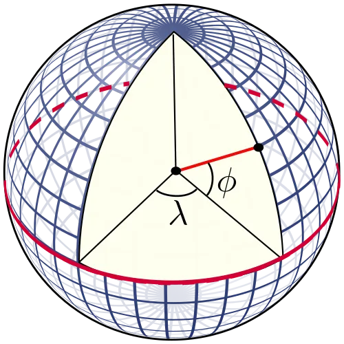

These topics are typically part of the IUB course[AST 201: Introduction to Astronomy](https://cassa.bd/abekta/courses/ast201), and a few more subjects from its syllabus were then introduced: coordinate systems, constellations, astronomical objects, and their magnitude. Since every astronomical measurement must be directed toward a specific location in space and at a particular time, establishing sky [coordinate systems](https://cassa.bd/abekta/un/coordinate-systems) to identify these locations is essential. Because observers perceive equal distance in all directions, the sky appears as a globe surrounding the Earth, leading to the adoption of the ‘equatorial coordinate system’ (**ECS**), which is the most widely used astronomical coordinate system and is modeled after the ‘geographic coordinate system’ (GCS). Analogous to the GCS's latitude ($\phi$ in the image) and longitude ($\lambda$), the ECS uses declination (ranging from 0 to ±90 degrees from the equator) and right ascension (RA, ranging from 0 to 360 degrees along the equator). The GCS equator (red line) is projected onto the sky to define the ‘celestial equator,’ and the ‘March equinox’ point on the celestial equator is set as the 0-degree RA reference. The March equinox point itself is defined as the intersection of the ecliptic plane (the plane of the solar system) and the equatorial plane, which is tilted 23 degrees relative to the ecliptic plane.

Astronomers also need to use the 'horizontal coordinate system' (**HCS**), which is based on the observer's local horizon. Its fundamental plane is the horizontal plane, perpendicular to the observer, extending from north to south and east to west, with the point directly overhead called the zenith. Astronomical objects continuously rise, set, and move in the HCS due to the Earth's daily rotation (360 degrees in 24 hours, or 15 degrees per hour). When an object rises in the east, its 'hour angle' is considered to be -6 hours; it reaches 0 degree when it is on the meridian (the line directly overhead from the north to south celestial poles), which is its culmination, or highest altitude from the horizon. Because an observer only sees one hemisphere, the altitude ranges from 0 to +90 degrees, unlike the ±90 degrees range for declination. The azimuth of an object, which is measured eastward along the horizontal plane from the north, similar to how RA is calculated along the equatorial plane, also ranges from 0 to 360 degrees.

The HCS should be considered the coordinate system for the telescope, while the ECS is the coordinate system for the celestial object being observed. Calculating the relation between the two is essential for any astronomical observation. While the RA and Declination of a star do not change in a given day, its altitude and azimuth constantly change as it traces an arc from east to west. All these angles can be measured in degrees, arcminutes (one-sixtieth of a degree), and arcseconds (one-sixtieth of an arcminute). However, RA is almost always given in hours, minutes, and seconds for historical reasons. For example, the star Sirius has an RA of 06h 45m 08.917s, which is equivalent to 6.7525 hours, or 6.7525 x 15 = 101.287 degrees. It is important not to confuse minutes and arcminutes, or seconds and arcseconds; the former are units of time, and the latter are units of angle.

The celestial objects accessible for imaging using our own telescopes or those available through online subscription services encompass planets, comets, asteroids, stars, star clusters, nebulae, supernova remnants, galaxies, and galaxy pairs. An object's brightness is quantified by its **luminosity** (measured in watts, equivalent to power), but determining its intrinsic luminosity is challenging because brightness is affected by the distance of an object from us. What telescopes actually measure is **flux**, a quantity whose unit is watts per square meter, which inherently decreases with distance. Because these figures can become quite unwieldy, astronomers use a simple, unitless number called **absolute**[magnitude](https://cassa.bd/abekta/un/magnitude) to represent luminosity, and **apparent** magnitude to represent flux. The logarithmic apparent magnitude scale spans a range from -30 to +30; for context, the sun is -26.8, the moon is -12.6, the brightest stars are around 0, the faintest stars visible to the unaided human eye are +6, and the dimmest object observable by the Hubble Space Telescope (HST) is around +30. More detailed information can be found in the linked article.

In order to get an intuitive feel for the sky, it is useful to project its round surface onto a two-dimensional plane, much like how Google Maps creates a flat representation of the spherical Earth. This method also directly relates right ascension (RA) and declination to longitude and latitude, respectively. On such a map, which displays the entire sky as visible from Earth, RA is placed on the x-axis and declination on the y-axis. Similar to how a world map is divided into countries, the sky map is segmented into 88 zones known as[constellations](https://cassa.bd/abekta/bn/un/constellations). These 88 constellations collectively cover the entire celestial sphere, meaning every object belongs to one of them. Astronomers pinpoint an object by using its location within a constellation and its distance along our line of sight. The sun and other solar system objects travel through about 12 of these constellations in a year, which make up the zodiac. For example, the Gemini constellation is situated at approximately RA 7 hours and declination +20 degrees. These constellations serve as a human link not only to the sky but also to the entire history of humanity over the last 50,000 years through mythology and folklore.

### Session 4: Imaging with iTelescope (4:00 - 6:00)

The first three sessions were intended to provide students with the foundational concepts necessary for the workshop's practical component: capturing long-exposure images of astronomical objects using the remote telescopes of[iTelescope](https://www.itelescope.net/) and then processing the raw image frames into a finished image. This hands-on session, led by Shahal, demonstrated the process of using[Telescopius](https://cassa.bd/abekta/un/telescopius) to select an appropriate observation target and formulate an initial plan. While the linked articles offer a more elaborate description, the key points of the process will be summarized here.

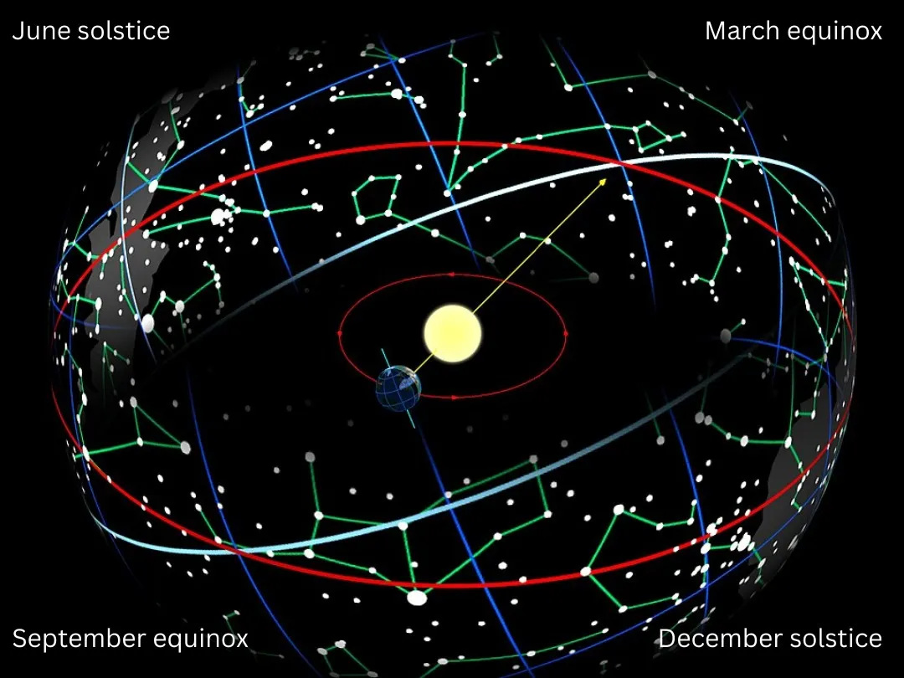

Different objects are visible at night on different days and months from a particular location on Earth. The primary reason for this is the Earth's orbit around the Sun. For instance, consider this figure: the Sun is currently positioned toward the March equinox from Earth, which is the intersection of the equatorial (blue) and ecliptic (red) planes. Consequently, in March, we cannot observe objects in the constellations near the March equinox because that region of the sky faces the sunlit side of Earth. These objects are only visible during the day, when the sun's brightness makes them impossible to see. During this period, we can only observe the sky on the nightside, which is near the September equinox. The reverse situation would occur six months later in September, when the Sun is positioned toward the September equinox. Similar examples can be drawn using the June and December solstices (when days and nights are nearly equal globally). Furthermore, observers in the northern hemisphere can never see objects close to the south celestial pole (SCP, the extrapolation of the geographic south pole), and those in the southern hemisphere cannot see objects close to the north celestial pole (NCP). This demonstrates that both geographical location and the calendar profoundly influence the visibility of celestial objects.

https://youtu.be/Bf63BxhTssY

Using[Stellarium Web](https://stellarium-web.org/), you can view a live simulation of the sky from your current location. Furthermore, you have the ability to change the location to any other place on Earth and adjust the date to various points in the past or future. In the video shown above, you can observe the constellation Ursa Minor rotating around its star Polaris, which is located very close to the North Celestial Pole (NCP). You will notice that this rotation is visible when the hour, month, or day is changed, but it does not change when the year is altered. Consider why this might be the case.

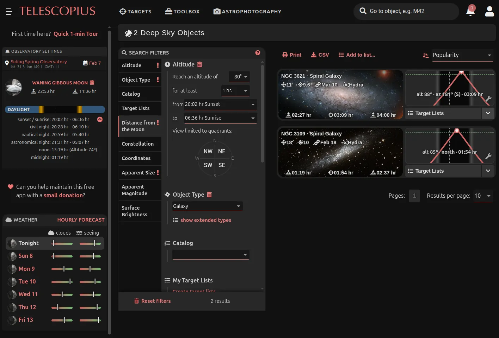

For selecting your target object, the process begins on [Telescopius](https://telescopius.com/) by choosing a location. iTelescope provides telescopes across many dark-sky sites, and for this demonstration, we will use either the American (Utah Desert) or the Australian (Siding Spring) facilities. Let us select the Siding Spring observatory for February 7, 2026. Upon clicking 'TARGETS' and selecting 'Deep Sky,' a list of over 12,000 objects becomes available. The first critical filter is **altitude**. To capture a high-quality image with an exposure exceeding one hour, the object must remain at or above a specific altitude, such as 80 degrees, for more than an hour as it traverses its arc from rising to setting. Applying a filter for an altitude of 80 degrees and a duration of one hour reduces the target list to 635 objects. Further refining the search by selecting the object type 'Galaxy' narrows the list to 386. Selecting a minimum distance from the Moon of 30 degrees leaves 217 objects. The final option for adjustment could be the apparent size. Considering the Moon's size is approximately 30 arcminutes, a galaxy smaller than 10 arcminutes may not be as impressive, though this depends on the telescope's field of view (FoV) and resolution. Setting the size range from 7 to 30 arcminutes for now leaves us with only 4 sources.

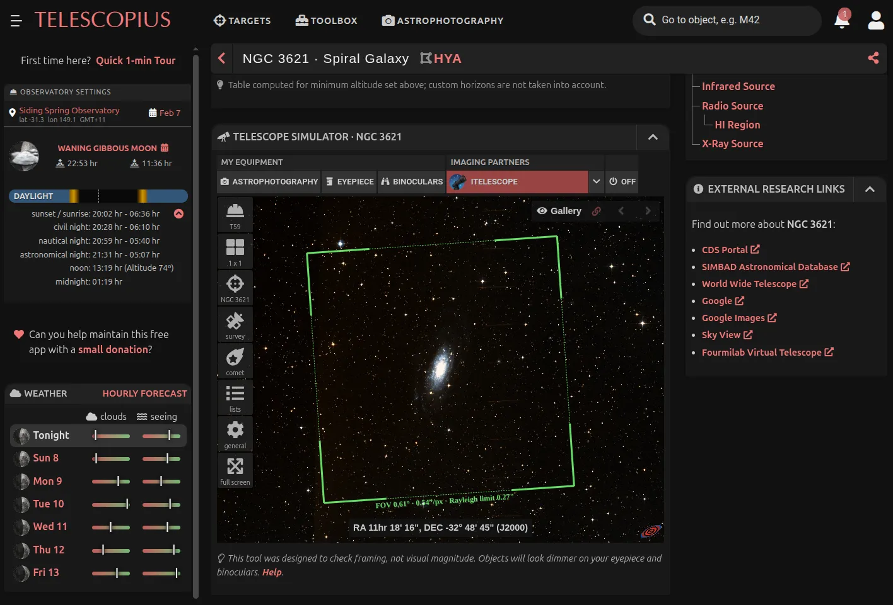

Of these four, NGC 3621 appears promising, and its track from rise to set can be seen on a plot. Selecting this object brings up its dedicated page, where scrolling down reveals the TELESCOPE SIMULATOR. This tool is invaluable for perfectly framing the object with a chosen telescope. If the Australian telescope T59 is selected, the 11 arcminute galaxy fits well within the instrument's 35 arcminute FoV. All telescopes, with the exception of T8 and T10, appear to provide good framing, allowing for selection from the remaining options. It should be noted that a standalone[Telescope Simulator](https://telescopius.com/telescope-simulator) is also available for entering custom telescope specifications to check framing. The essential data required to calculate a telescope's field of view and resolution includes the telescope's aperture diameter, focal length and sensor size in millimeters, and sensor resolution in pixels.

## Day 2: Jan 16

### Session 5: Processing iTelescope images (11:00 - 1:00)

Before capturing their own images, different groups were given some instructions on the first half of the day about how to use Siril to process raw images captured by iTelescope. A dataset captured during the previous day was used for this purpose. The detailed instructions are given in the [Universe article ‘Siril’](https://cassa.bd/abekta/workshops/dw/siril-processing-for-itelescope) but here we outline the key steps.

The journey from raw iTelescope data to a polished celestial masterpiece begins with meticulous **data organization**. Essential calibration frames,including darks to remove thermal noise, flats to correct vignetting, and biases for sensor read noise,must be sorted into specific directories. These are placed in folders like "darks," "flats," and "biases," while the primary target exposures go into a "lights" folder. For multi-filter data, separate folders for L, R, G, and B are required. This structure allows Siril’s automated scripts to efficiently handle the heavy lifting of calibration and registration, ultimately merging dozens of separate exposures into a single, high-fidelity stacked [FITS](https://fits.gsfc.nasa.gov/) file.

Once stacking is complete, the focus shifts to correcting atmospheric and sensor-induced artifacts through **background extraction**. [Using Siril](https://siril.org/download/), users generate sample points across the sky, carefully avoiding stars and bright nebular structures to model the background gradient. This step removes unwanted sky glow, ensuring a uniform foundation for the next critical phase: **astrometry**. By entering the imaging setup's focal length and camera pixel size, Siril’s solver assigns precise celestial coordinates to every pixel. If the internal solver fails, external tools like [Astronomy.net](https://nova.astrometry.net/) (NOVA) can provide a ‘plate-solved’ FITS file, which is vital for the physically accurate color calibration and scientific measurements that follow.

The transition to true-to-life color is achieved through **Spectrophotometric Color Calibration** (SPCC). Unlike traditional balancing, SPCC compares the measured light flux of stars in the image against massive astronomical catalogs with known spectral data. By selecting the correct filter set and camera sensor response, Siril computes precise correction factors for the red, green, and blue channels. This ensures that the stars and nebulae appear exactly as their physical properties dictate, rather than being skewed by local light pollution or sensor bias. The resulting image is now a scientifically grounded representation of the cosmos, though it remains in a dark, linear state that requires stretching to reveal its hidden beauty.

**Stretching** is where the faint details of the universe finally become visible to the human eye. Beginners often start with a Histogram Stretch, gradually shifting the midtone and shadows sliders to brighten the image without clipping the data. For more professional results, the Generalized Hyperbolic Stretch (**GHS**) offers finer control, allowing users to enhance faint nebulosity while preventing bright star cores from saturating. By repeating these adjustments in small, incremental steps, the processor maintains a delicate balance between high-contrast highlights and deep, rich shadows. This non-linear transformation turns a dim, data-heavy file into a vibrant scene teeming with cosmic structures, setting the stage for the final aesthetic refinements.

The final touches involve **sharpening and denoising** to achieve professional clarity using AI-enhanced tools like [Cosmic Clarity](https://www.setiastro.com/cosmic-clarity). Integrated into Siril via scripts, these models intelligently distinguish between unwanted grain and fine astronomical detail. Users can apply full denoising to the entire image or target the luminance channel specifically to preserve color integrity. Similarly, sharpening can be restricted to star profiles,making them appear crisp and pinpoint,or applied to the entire field to bring out the intricate textures within galaxies and nebulae. This sophisticated cleanup process results in a clean, public-ready image that showcases the breathtaking depth of space while upholding the technical excellence expected by the local community.

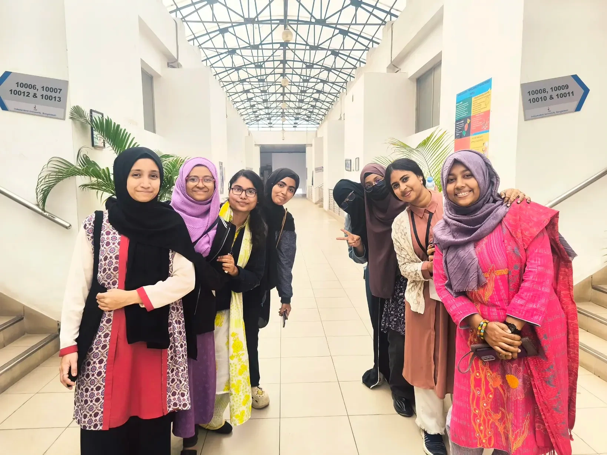

### Session 6: Writing about astronomical objects (3:00 - 4:00)

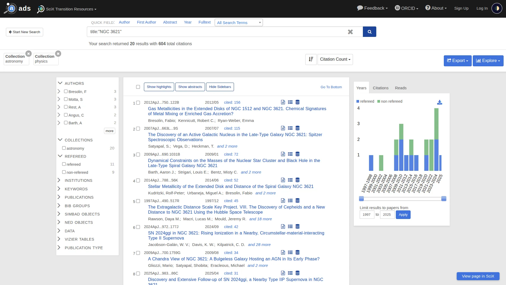

Asad briefly explained the methodology for writing an essay about an astronomical object that is suitable for publication on the specified webpage of the CASSA Durbin website. Throughout the year, Durbin volunteers will participate in weekly Event Horizon meetings, where each volunteer will be assigned an object to work on. For each assignment, a person will receive a Google[NotebookLM](https://notebooklm.google.com/) (NLM) and a Google Doc, which will be sent to them via an email from the Durbin Project Manager.

After receiving the object assignment, the NotebookLM, and the Doc, the first step is to identify a minimum of 5 and a maximum of 10 journal papers on the object from the[Astrophysics Data System](https://ui.adsabs.harvard.edu/) (ADS) or the Science Explorer ([SciX](https://scixplorer.org/)). From the initial search results, volunteers must select only those papers that focus explicitly on the assigned object, excluding those that merely mention it among others. The simplest method for this is to search using the prompt title:"NGC 3621", which will return papers where the object's name is in the title. You can sort these papers using “Citation Count” to find the most impactful ones. A better search can be performed using the[Gemini Gem called Astrophysicist](https://gemini.google.com/gem/1K43rZWHD4mensCRMBd454gX6KGAU2DEm?usp=sharing). By actively engaging with this Gem, they should finalize the 5 to 10 primary papers. Only these final papers should be downloaded from the original journal via the ADS links. Volunteers must always strive to download the journal-published version, not the preprint from arXiv, though arXiv can be used if the journal version is unavailable. The filename of each PDF must strictly follow the format: last name of the first author and the year, separated by an underscore (e.g., Asad_2021.pdf), with no exceptions. These renamed files must then be uploaded to the assigned NotebookLM.

Next, using the NLM, the volunteer must write a single, seamless essay of between 500 and 700 words. The essay should be easily readable aloud and must not contain any headings or bullet points. It should consist of 5 to 7 paragraphs, with each paragraph being approximately 100 words long and focusing on a different aspect or discovery about the astronomical object that is easy for a general, non-scientific audience to understand. The volunteer should prompt the NLM to extract one compelling or amazing discovery at a time and write a paragraph on it, ensuring only one paragraph is written per prompt. For every paragraph, the volunteer must double-check the facts using the references provided by the NLM at the end of sentences. The collected paragraphs are then to be assembled into the Google Doc, where further editing, stitching them into a seamless essay, and proofreading will be done, with the assistance of Gemini for refinement.

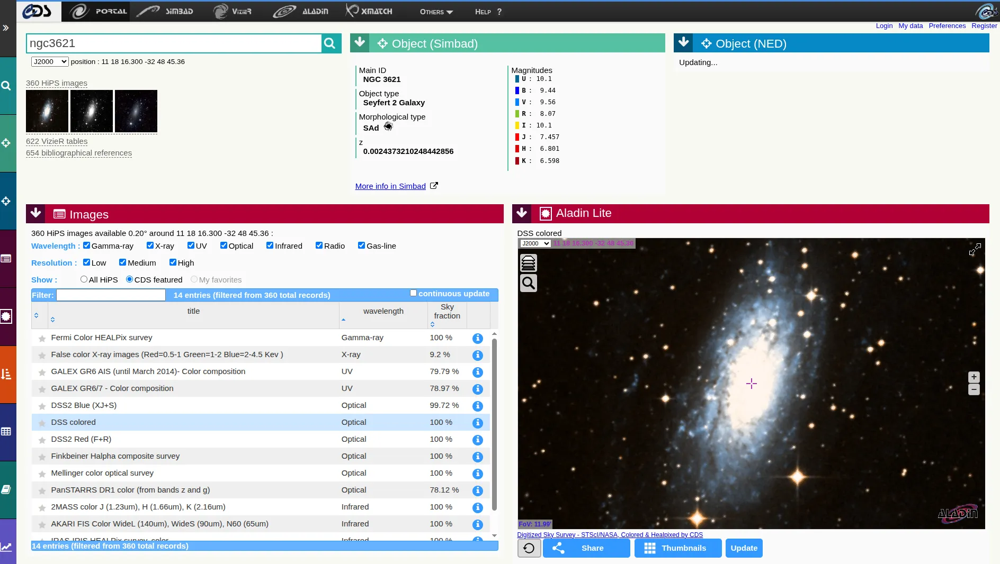

The final step requires the volunteer to find approximately 5 images of the astronomical object from the Centre de Données astronomiques de Strasbourg ([CDS Portal](https://cdsportal.u-strasbg.fr/)) or the Strasbourg Astronomical Data Centre. These images must collectively span a wide range of frequencies, from infrared to X-ray. If high-quality images are insufficient on the CDS Portal, the volunteer is permitted to search for modern space telescope images online, provided they are from reliable sources. The downloaded CDS images must be free of 'reticles' (the cross in the middle), resized to about 500 pixels, and kept under 60 KB in size. They must also be renamed using the specific format: frequency_telescope.png (e.g., IR_JWST.png). Upon completing all these tasks, the volunteer must reply to the original assignment email to confirm completion and attach the five downloaded images.

### Session 7: Imaging with iTelescope in groups (4:00 - 6:00)

Now that the participants had learned how to select a target using Telescopius, process iTelescope data with Siril, and write about an astronomical object, each group proceeded to select their target and plan the observations using the[iTelescope Launchpad](https://go.itelescope.net/) (which requires a login). The groups made the following selections: Group 1 chose the object NGC 4258 with telescope T05; Group 2 selected NGC 1365 with T30; Group 3 picked NGC 5457 with T68; Group 4 also chose NGC 2068 with T30; and finally, Group 5 opted for NGC 2024 with T21. To proceed, after logging into the Launchpad, a user must navigate to the specific page for their chosen telescope. On the telescope page, the "Imaging / Plan" -> "Deep Sky Objects" interface is where the observation plan is configured.

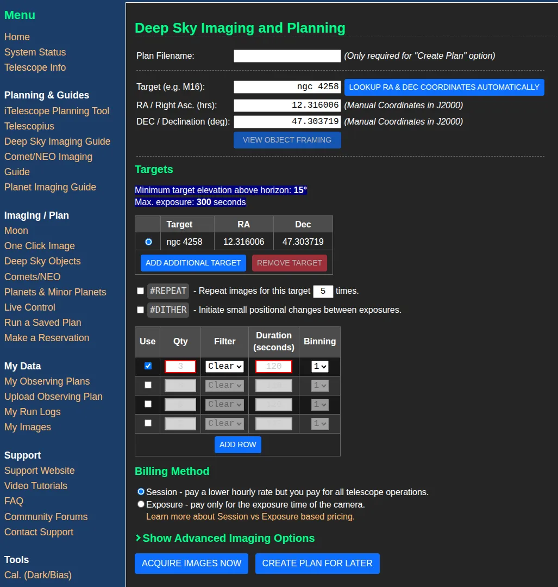

Using the Menu on this page, a group of students created an imaging plan by inputting the object name and specifying the necessary exposures for the filters available on that particular telescope. They typically capture three images for red, green, and blue, one for the total intensity (luminance), and can select more, such as H-alpha, if available. After pressing “CREATE PLAN FOR LATER,” this plan is saved. The group then schedules the plan for a specific time using the calendar found on the “Make a Reservation” page. Available timeslots are visible on the calendar, and the planned observation can be inserted by following the on-screen instructions. Once the observations start, the telescope's current status can be monitored on the terminal, which is accessible via the “System Status” page from the Menu. After the observation is complete, the data can be downloaded from the “Download my data” option on the initial Launchpad page.

## Day 3: Jan 17

### Session 8: Astronomical optics (11:00 - 11:40)

The third day was entirely devoted to preparations and the final presentations, aside from a short lecture on astronomical optics delivered by Asad. This session provided a foundational overview of telescope function, resolution, and sensitivity. An optical telescope operates with three core components: a collector that gathers and focuses light onto a focal plane; a detector in the focal plane, typically a Charge Coupled Device (CCD), that converts incoming photons into electrons; and a processor that constructs the final image. This is analogous to human vision, where the pupils act as the collector, the retina as the detector, and the brain as the processor. The following diagrams are borrowed from the book *To Measure the Sky* by Frederick R. Chromey.

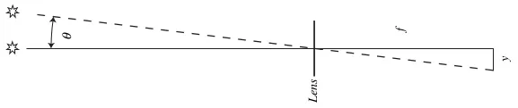

The main purpose of the telescope is to focus parallel light rays from a distant source onto the focal plane, over a specific focal length, $f$. As illustrated in the diagram, the telescope functions as an angular translator, taking the object's angular size in the sky, $\theta$, and converting it into a physical linear dimension, $y$, on the detector. This relationship is defined by the image scale, $s$, which is expressed mathematically as $s = \theta / y = 1/f$. Consequently, the telescope's focal length is the key determinant of both magnification and resolution: a longer $f$ results in a smaller plate scale value $s$, meaning that a specific angular distance $\theta$ will correspond to a larger physical distance $y$ across the focal plane.

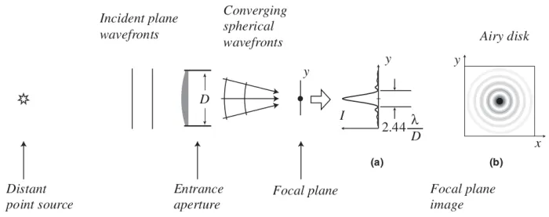

However, just like the human eye, telescopes do not achieve perfect vision. The fundamental limitation comes from **diffraction** caused by the aperture (the mirror or lens) itself. As illustrated in the diagram, plane waveforms from a distant, point-like source (such as a star) enter the entrance aperture. Multiple secondary waves are generated at the aperture, which then interfere to create an interference pattern on the focal plane. This interference is constructive near the center, resulting in a bright central lobe, surrounded by alternating stripes of constructive and destructive interference (highs and lows, sidelobes). The resulting image is known as the **Airy disk**, named after the scientist who first described it. Since the initial 'point' of light has spread into a rippled disk, the Airy disk is also referred to as the **point spread function** (PSF). The width of the main lobe is defined by the angle $2.44 \lambda/D$ (in radians, where $\lambda$ is the wavelength), which represents the degree to which the light has spread. **Resolution** of the telescope is defined as half of this value. A larger aperture diameter ($D$) will yield a lower resolution value, which is desirable as it signifies the telescope's ability to distinguish smaller structures in the sky.

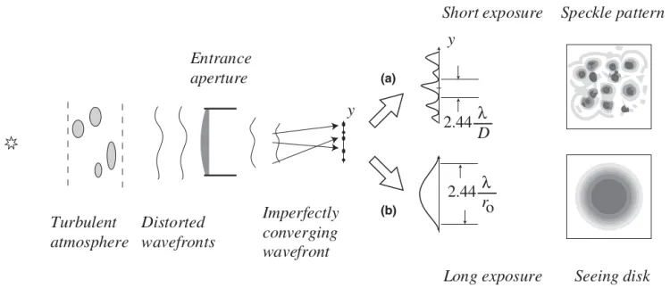

The Earth's atmosphere introduces the next most significant form of distortion. Moving turbulent air pockets, or "lumps," within the atmosphere possess varying indices of refraction ($n$), causing the incoming plane wave of light to undergo rapid, time- and direction-dependent refractions. As a result, the plane wave becomes distorted, leading the light to converge on different points on the focal plane at different moments. When a series of very short exposures (e.g., 1/20th of a second) is taken, a **speckle pattern** is observed, where each speckle is an Airy disk. Conversely, in long exposures, these individual speckles are blurred and averaged out, producing a disk much larger than the Airy disk, which is called the **seeing disk**. Therefore, for all ground-based telescopes, the final angular size of a point-like star in the image is determined not only by aperture diffraction but also by atmospheric refraction, which further lowers the overall resolution. The size of the main lobe of the seeing disk is approximately $2.44 \lambda / r_0$, where $r_0$ is the typical size of an atmospheric lump. Because our eyes are smaller than $r_0$, we do not perceive the speckle pattern; instead, we observe the brightness of stars fluctuating, an effect known as **scintillation** (twinkling).

### Session 9-10: Preparations and Presentations

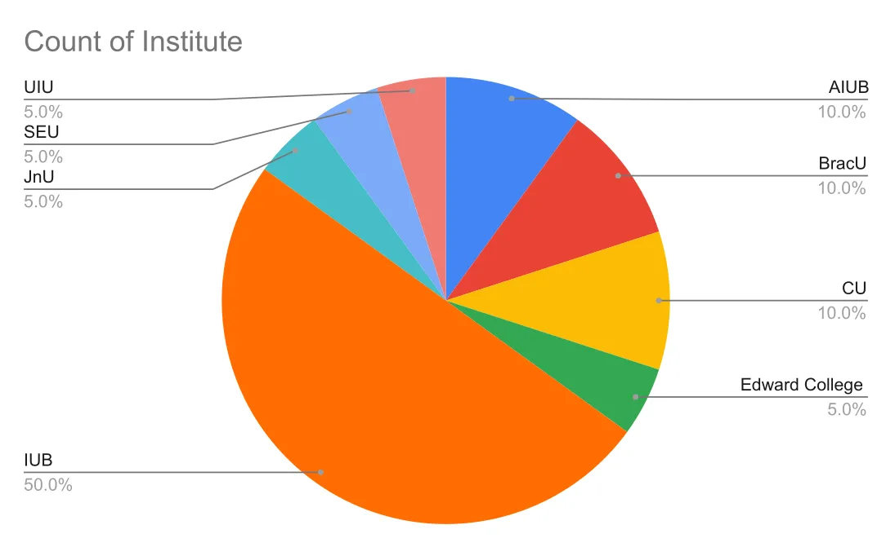

Participants from these eight institutions prepared their final presentations for the workshop's culmination. Each of the five groups collaborated until 4:00 PM, and the presentations commenced at 4:30 PM. The four students within each group divided the content to create a seamless final presentation with four distinct topics. The first student focused on observation planning, including their selected telescopes and the imaging process. The second student presented the image processing steps and described their final processed image. The third student performed a comparison of their iTelescope image with five professional images of the same object taken by larger telescopes. Finally, the fourth student discussed the popular essay they had written on the object, following the guidelines from the preceding writing session. Asad and Lima graded the students and asked questions regarding their interest in becoming Durbin volunteers. Showing great enthusiasm for continued involvement, 14 attendees were subsequently chosen to become Durbin volunteer applicants, as the program will continue its volunteer recruitment throughout 2026.

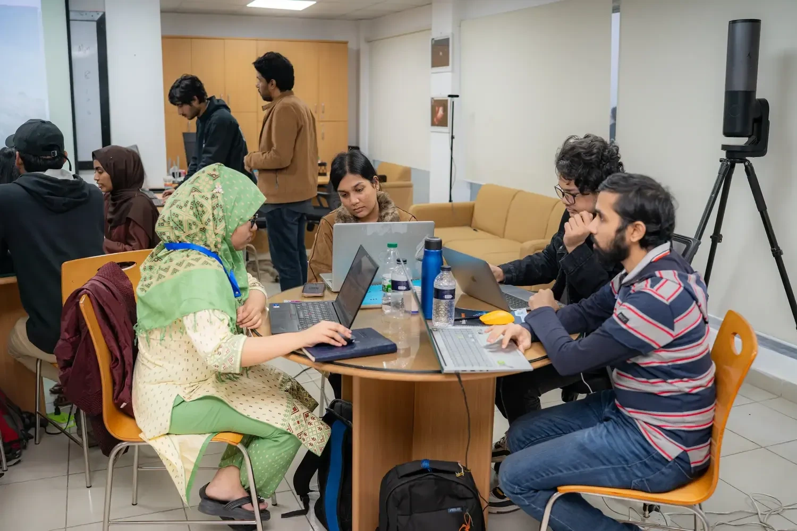

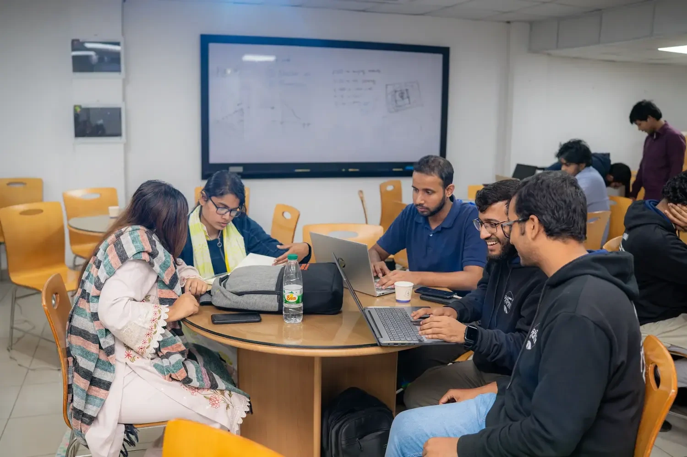

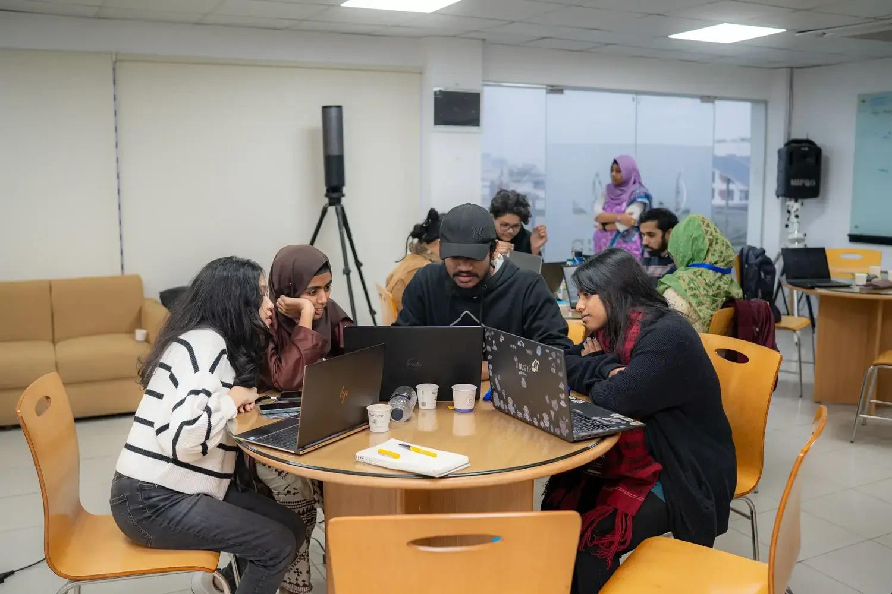

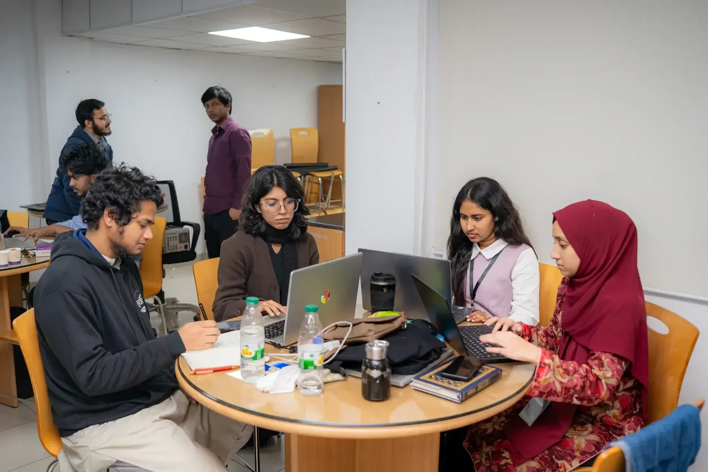

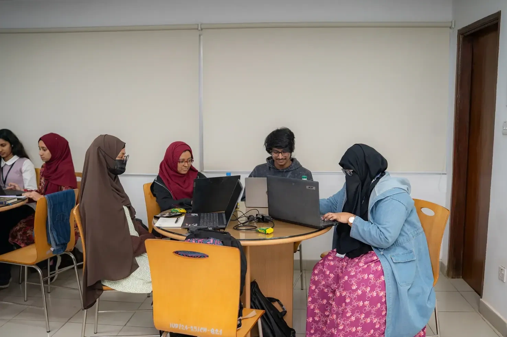
