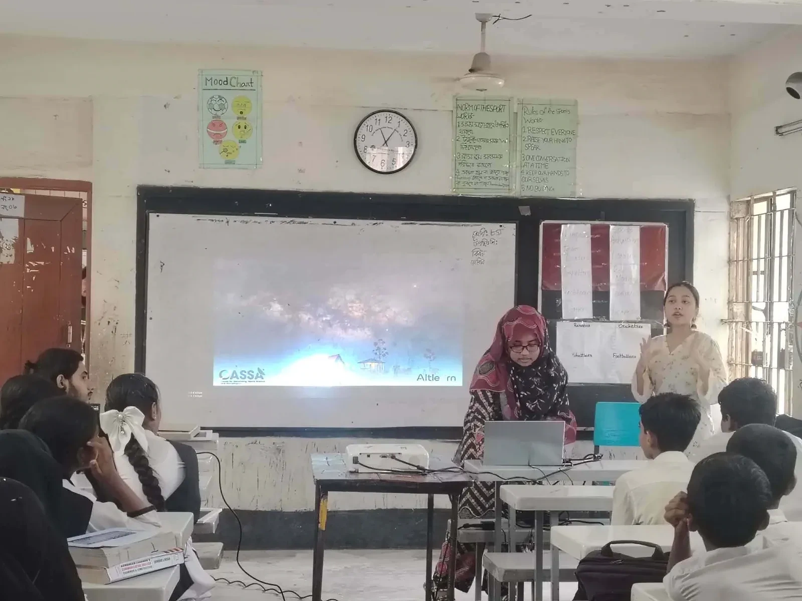
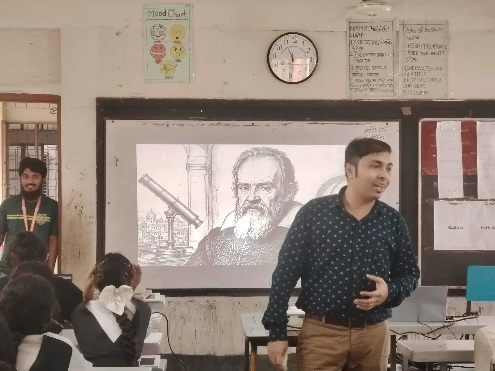
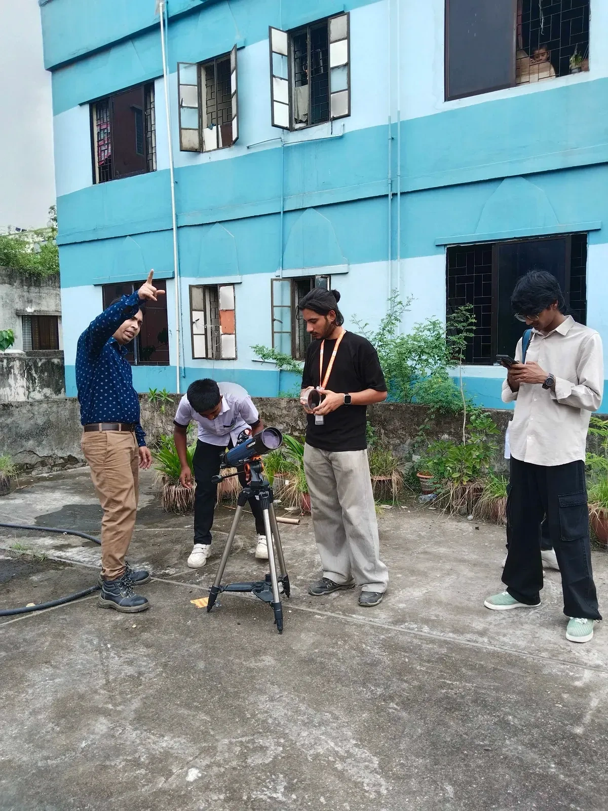
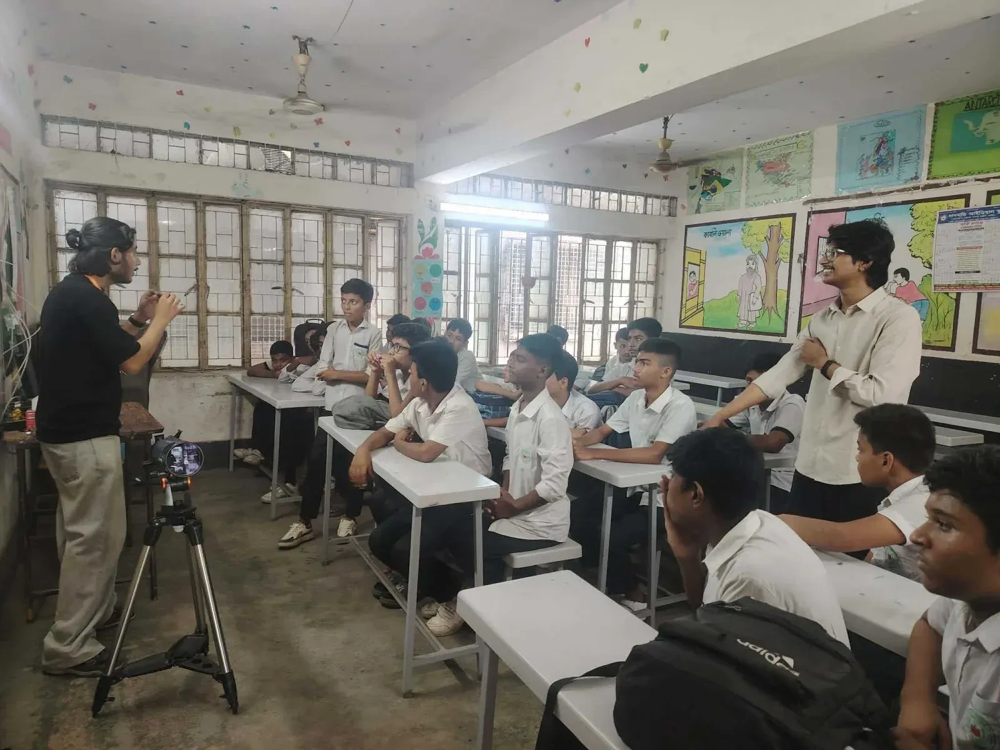
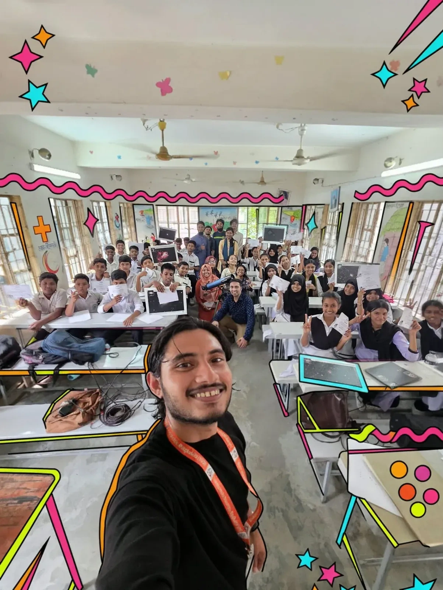

The classrooms of Moneshwar Government Primary School buzzed with excitement as Durbin, the outreach initiative of CASSA (Center for Astronomy, Space Science and Astrophysics), spent a day introducing students to the wonders of the universe. With an eight-member team carrying telescopes, astrophotography, and interactive activities, the workshop transformed an ordinary school day into an unforgettable journey through space for students of classes 7 and 8.

The program began with an introduction to CASSA and Durbin's mission of making astronomy accessible to young minds across Bangladesh. This was followed by a storytelling session that took students back through history, exploring how ancient civilizations once looked at the night sky and how Galileo Galilei changed humanity's understanding of the universe with the telescope. The session quickly turned lively as students eagerly joined the discussions, asking questions about stars, planets, and how people first began studying the sky centuries ago.

*The day opens with an introduction to CASSA and Durbin's mission of making astronomy accessible to young minds across Bangladesh.*

*A storytelling session traces how ancient civilizations read the night sky and how Galileo Galilei transformed our understanding of the universe with the telescope.*

Things got even more fun when two volunteers pulled up 'Scale of the Universe', an interactive website that starts small, like, really small, and keeps zooming out until you've gone past planets, stars, and entire galaxies. A short video of similar concept was played alongside it, and as object after object popped up on screen, jaws kept dropping a little further each time. Students fired off questions about planets and how far apart they actually sit from one another, and with every zoom-out, the room seemed to collectively realize just how small a place we occupy in this enormous universe. It felt less like a class and more like a group road trip through space, with everyone discovering the scale of things together.

After a short brain break, the workshop split into two parallel sessions with the motto to divide and conquer. One group headed up to the rooftop to get hands-on with the Celestron 200AZ telescope, learning the basics of how telescopes work, how astrophotography is done, and how astronomers manage to capture images of objects light-years away. Meanwhile, the rest of the students stayed downstairs for a constellation activity, connecting dots on paper to create their own star patterns and stories. To spark their imagination, volunteers also pulled up Stellarium so the students could see real constellations in the night sky, which gave them ideas and inspiration for the patterns and stories they went on to create. Volunteers also showed off some stunning space photographs taken by previous Durbin astrophotographers, and quite a few students were genuinely surprised that such images could be captured right here in Bangladesh.

*On the rooftop, students get hands-on with the Celestron 200AZ telescope.*

*Volunteers walk the students through the basics of how telescopes work and how astronomers capture images of objects light-years away.*

As the day came to an end, students gathered for a large group photo, proudly holding up their constellation drawings and astrophotography frames. Exit tickets were then handed out, where students wrote one thing they had learned and rated their experience using emoji reactions. But perhaps the most touching moment arrived unexpectedly, when curious Class 4 students peeked into the classroom and shyly asked, "Will you come again when we grow up to Class 7 or 8?" It was a simple question, yet it perfectly captured the spirit of the day, proof that curiosity alone can light the spark for learning, discovery, and perhaps even a future among the stars.

*The Durbin team with the students of classes 7 and 8 at the close of the day.*

*Written by Farhana Ferdous*

*Present at the event: Farhana Ferdous, Md Shahadat Hossain Shahal, Ashratul Zannati Purnota, Nafia Nufrat Papry, Farzana Akter Lima, Ahmad Al-Imtiaz, Shaibal Saha, Aiman Sheikh.*
