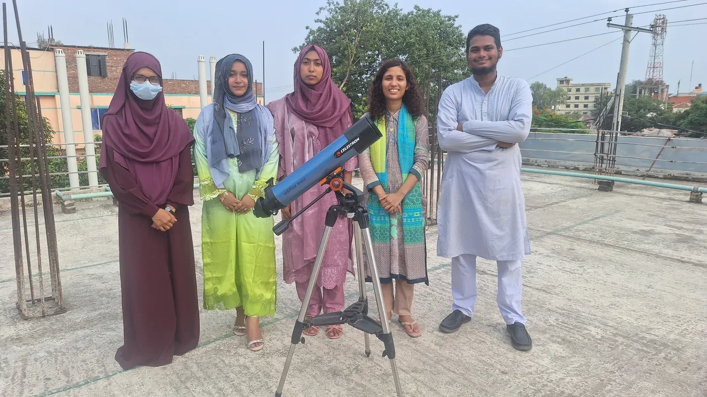
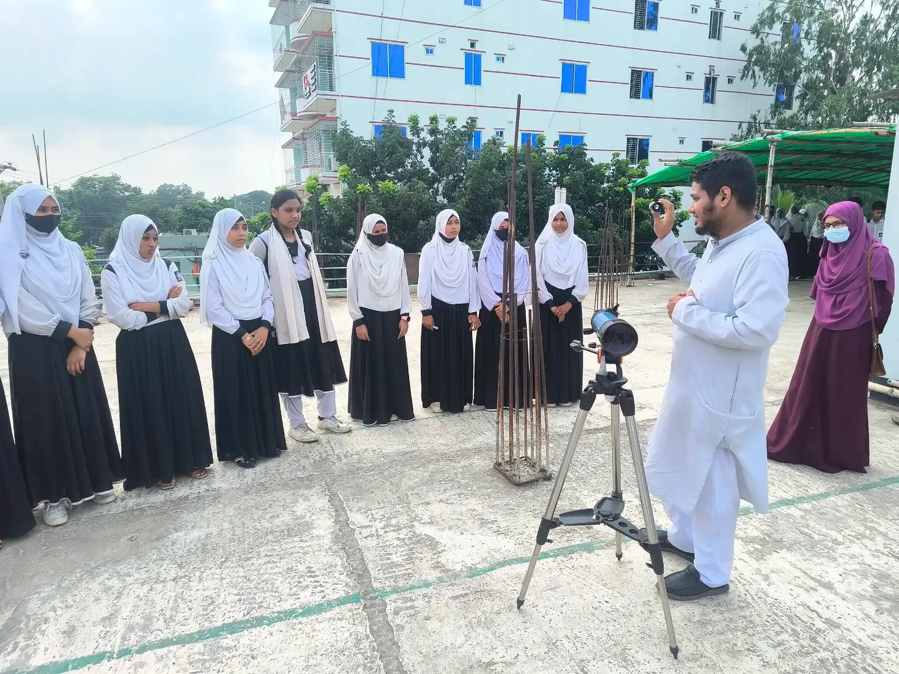
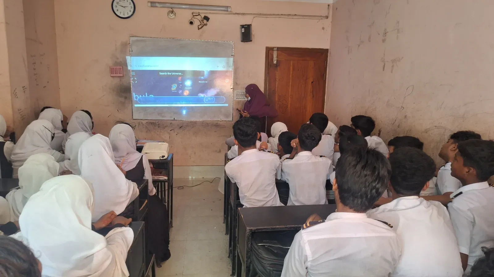
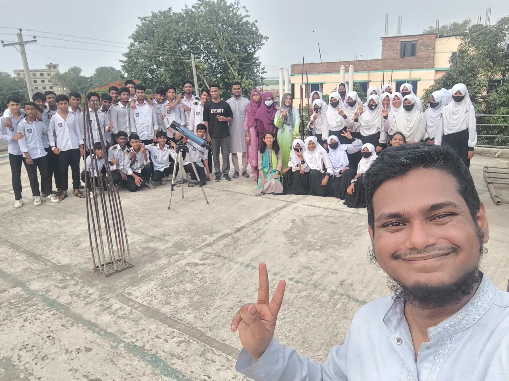

It started as a nagging thought in early June, right as plans for Durbin's first-ever imaging camp in Northern Bangladesh were nearly locked in. An imaging camp alone would light up the sky for a handful of astronomy enthusiasts, but what about everyone else? The idea landed on Tasnin, who signed on without hesitation, and just like that, the Durbin School Outreach Program was born, slotted right alongside the imaging camp near her home in Nagarbari. The remote riverside location made the choice obvious: students out here rarely get a shot at astronomy the way city kids do, and the team decided to go all in on a half-day program for 50 students, packed with fundamentals and hands-on activities.

Turning the idea into a real event took more than enthusiasm. With Eid holidays keeping everyone apart, the planning moved entirely online, round after round of calls, a proposal sent to CASSA, several rounds of revisions, and finally, roles handed out across the team. By the time volunteers started converging on Pabna, the plan was tight: Adiba arrived from Dhaka with a telescope in tow, Shanjida made the trip from Naogaon, and Maria joined from right there in Pabna. Everyone regrouped at Tasnin's house to prep materials and refreshments before heading out on the morning of June 11 to the venue, Nagarbari Maritime School and College, sitting right where the Padma and Jamuna rivers nearly meet.

The school's riverside setting had volunteers buzzing before the event even began. After a quick chat with the principal, the team split in two: one group would run a telescope session for the primary students, the other would lead the main outreach program. At 11:30 AM sharp, everything kicked off with hopeful hearts and nervous jitters. Adiba and Rownok took the younger students out for telescope viewing, but the sky, never one to cooperate, was solid clouds, so they pivoted to scoping out distant terrestrial sights instead. Meanwhile, Tasnin opened the main session with an introduction to the sky, its history, constellations, and telescope basics, while other volunteers ran informal astronomy chats with students from classes that weren't part of the main program.

*The Durbin volunteers who travelled from Dhaka, Naogaon, and Pabna to run the program at Nagarbari Maritime School and College.*

*With the sky under solid cloud, the telescope session pivoted to distant terrestrial sights while students learned how the instrument works.*

The sessions kept building from there. Adiba took over next, unpacking why telescopes matter, sharing astrophotography from the team's own campaigns, introducing CASSA, and demoing Stellarium before students got hands-on with a drawing activity. After a snack break, things went cosmic, literally. Two students helped act out just how vast the Solar System really is, Shanjida pulled up the Scale of the Universe website to zoom out even further, and a video kicked off group activities that had students debating, questioning, and exploring ideas together, wrapping up in a flurry of good energy.

*Inside the classroom, the Scale of the Universe website zooms out from the everyday to the cosmic, driving home just how small a place we occupy.*

The day was supposed to close with solar observation, led by Maria, except the Sun, much like the stars two nights later, apparently had other plans and stayed hidden behind clouds all day. Undeterred, the team turned the telescope on the Jamuna instead, letting students spot riverside houses and boats drifting across the water while picking up the basics of how a telescope actually works. A round of photos and feedback wrapped things up before the team packed in and rolled straight into prep mode for the imaging camp still ahead.

*Photos and feedback close out the half-day program before the team turned to prep for the imaging camp still ahead.*

*Written by Farhana Ferdous*

*Present at the event: Adiba Habiba, Tasnin Ara, Rownok Shahriar, Mst. Maria Khatun, Shanjida Nahar.*
